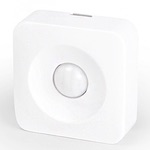

*To contribute to this page, edit the following
[file](https://github.com/Koenkk/zigbee2mqtt.io/blob/master/docgen/device_page_notes.js)*

# Device

| Model | 3305-S  |
| Vendor  | SmartThings  |
| Description | Motion sensor (2014 model) |
| Supports | occupancy and temperature |
| Picture |  |

## Notes

None
