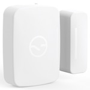

*To contribute to this page, edit the following
[file](https://github.com/Koenkk/zigbee2mqtt.io/blob/master/docgen/device_page_notes.js)*

# Device

| Model | 3321-S  |
| Vendor  | SmartThings  |
| Description | Multi Sensor (2015 model) |
| Supports | contact and temperature |
| Picture |  |

## Notes

### Device type specific configuration
*[How to use device type specific configuration](../configuration/device_specific_configuration.md)*

* `temperature_precision`: Controls the precision of `temperature` values,
e.g. `0`, `1` or `2`; default `2`.

