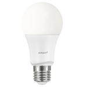

*To contribute to this page, edit the following
[file](https://github.com/Koenkk/zigbee2mqtt.io/blob/master/docgen/device_page_notes.js)*

# Airam 4713407

| Model | 4713407  |
| Vendor  | Airam  |
| Description | LED OP A60 ZB 9W/827 E27 |
| Supports | on/off, brightness |
| Picture |  |

## Notes

None

## Manual Home Assistant configuration
Although Home Assistant integration through [MQTT discovery](../integration/home_assistant) is preferred,
manual integration is possbile with the following configuration:


### 4713407

```yaml
light:
  - platform: "mqtt"
    state_topic: "zigbee2mqtt/<FRIENDLY_NAME>"
    availability_topic: "zigbee2mqtt/bridge/state"
    brightness: true
    schema: "json"
    command_topic: "zigbee2mqtt/<FRIENDLY_NAME>/set"

sensor:
  - platform: "mqtt"
    state_topic: "zigbee2mqtt/<FRIENDLY_NAME>"
    availability_topic: "zigbee2mqtt/bridge/state"
    unit_of_measurement: "-"
    value_template: "{{ value_json.linkquality }}"
```



