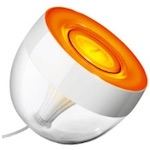

*To contribute tot his page, edit the following
[file](https://github.com/Koenkk/zigbee2mqtt.io/blob/master/docgen/device_page_notes.js)*

# Device

| Model | 7199960PH  |
| Vendor  | Philips  |
| Description | Hue Iris |
| Supports | on/off, brightness, color xy, power-on behavior |
| Picture |  |

## Notes

### Pairing
Philips LivingColors IRIS and Philips LivingColors Bloom Devices that comes with
Philips (HUE) Remote Gen 2 (Touch Wheel) or Gen 3 (Round Click Wheel) can be paired via Zigbee.
Devices with Gen 1 Remote don't use Zigbee and can not be paired.
The Philips LivingColors Remote can not be paired via Zigbee because it only support ZigBee Light Link (ZLL).

To Pair hold Button ON and Bottom Left Key (Favorite 1) on the Remote in Front of the Device until
the Device Light blinks and lights Orange. If connection was succesfull the Device Light will light Green.

**WARNING**: If you pair your Device to a Zigbee Network which is not using a ZLL Channel
you can't reset the Device with the Philips LivingColors Remote Gen 3.
The Gen 3 Remote will only try ZLL Channels to find the Device! Maybe it's possible to reset
the Device with a Philips LivingColors Remote Gen 2 as it should try all Zigbee Channels to find the Device.

[Philips LivingColors Bloom Manual](https://www.download.p4c.philips.com/files/7/7099760pu/7099760pu_dfu_eng.pdf)

[Philips LivingColors Iris Manual](https://www.download.p4c.philips.com/files/7/7099930ph/7099930ph_dfu_eng.pdf)

### Pairing
Factory reset the light bulb see
[HOWTO: Factory reset a Hue bulb](https://www.youtube.com/watch?v=qvlEAELiJKs).
After resetting the bulb will automatically connect.

This may also be possible with the
[Tradfri Remote Control](https://www.ikea.com/us/en/images/products/tradfri-remote-control__0489469_PE623665_S4.JPG)
by pressing and holding the reset button on the bottom of the remote (next to the battery).
[This may not always work](https://github.com/Koenkk/zigbee2mqtt/issues/296#issuecomment-416923751).

