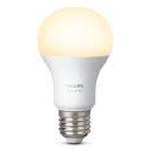

*To contribute to this page, edit the following
[file](https://github.com/Koenkk/zigbee2mqtt.io/blob/master/docgen/device_page_notes.js)*

# Device

| Model | 9290011370B  |
| Vendor  | Philips  |
| Description | Hue white A60 bulb E27 |
| Supports | on/off, brightness, power-on behavior |
| Picture |  |

## Notes


### Pairing
Factory reset the light bulb see
[HOWTO: Factory reset a Hue bulb](https://www.youtube.com/watch?v=qvlEAELiJKs).
After resetting the bulb will automatically connect.

This may also be possible with the
[Tradfri Remote Control](https://www.ikea.com/us/en/images/products/tradfri-remote-control__0489469_PE623665_S4.JPG)
by pressing and holding the reset button on the bottom of the remote (next to the battery).
[This may not always work](https://github.com/Koenkk/zigbee2mqtt/issues/296#issuecomment-416923751).


## Manual Home Assistant configuration
Although Home Assistant integration through [MQTT discovery](../integration/home_assistant) is preferred,
manual integration is possbile with the following configuration:


### 9290011370B

```yaml
light:
  - platform: "mqtt"
    state_topic: "zigbee2mqtt/<FRIENDLY_NAME>"
    availability_topic: "zigbee2mqtt/bridge/state"
    brightness: true
    schema: "json"
    command_topic: "zigbee2mqtt/<FRIENDLY_NAME>/set"

sensor:
  - platform: "mqtt"
    state_topic: "zigbee2mqtt/<FRIENDLY_NAME>"
    availability_topic: "zigbee2mqtt/bridge/state"
    unit_of_measurement: "-"
    value_template: "{{ value_json.linkquality }}"
```



