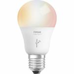

*To contribute to this page, edit the following
[file](https://github.com/Koenkk/zigbee2mqtt.io/blob/master/docgen/device_page_notes.js)*

# Device

| Model | AA69697  |
| Vendor  | OSRAM  |
| Description | Classic A60 RGBW |
| Supports | on/off, brightness, color temperature, color xy |
| Picture |  |

## Notes

### Pairing
Follow instruction from [Manual reset](http://belkin.force.com/Articles/articles/en_US/Troubleshooting_and_Tutorials/Resetting-the-OSRAM-LIGHTIFY-Tunable-White-60-Bulb#a).
After resetting the bulb will automatically connect.

