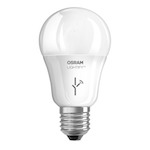

*To contribute to this page, edit the following
[file](https://github.com/Koenkk/zigbee2mqtt.io/blob/master/docgen/device_page_notes.js)*

# Device

| Model | AA70155  |
| Vendor  | OSRAM  |
| Description | LIGHTIFY LED A19 tunable white / Classic A60 TW |
| Supports | on/off, brightness, color temperature |
| Picture |  |

## Notes


### Pairing
Follow instruction from [Manual reset](http://belkin.force.com/Articles/articles/en_US/Troubleshooting_and_Tutorials/Resetting-the-OSRAM-LIGHTIFY-Tunable-White-60-Bulb#a).
After resetting the bulb will automatically connect.


## Manual Home Assistant configuration
Although Home Assistant integration through [MQTT discovery](../integration/home_assistant) is preferred,
manual integration is possbile with the following configuration:


### AA70155

```yaml
light:
  - platform: "mqtt"
    state_topic: "zigbee2mqtt/<FRIENDLY_NAME>"
    availability_topic: "zigbee2mqtt/bridge/state"
    brightness: true
    color_temp: true
    schema: "json"
    command_topic: "zigbee2mqtt/<FRIENDLY_NAME>/set"

sensor:
  - platform: "mqtt"
    state_topic: "zigbee2mqtt/<FRIENDLY_NAME>"
    availability_topic: "zigbee2mqtt/bridge/state"
    unit_of_measurement: "-"
    value_template: "{{ value_json.linkquality }}"
```



