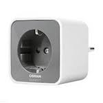

*To contribute to this page, edit the following
[file](https://github.com/Koenkk/zigbee2mqtt.io/blob/master/docgen/device_page_notes.js)*

# Device

| Model | AB3257001NJ  |
| Vendor  | OSRAM  |
| Description | Smart+ plug |
| Supports | on/off |
| Picture |  |

## Notes

### Pairing
For the OSRAM Smart+ plug (AB3257001NJ) hold the on/off button until your hear a click (+- 10 seconds).

