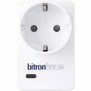

*To contribute to this page, edit the following
[file](https://github.com/Koenkk/zigbee2mqtt.io/blob/master/docgen/device_page_notes.js)*

# Device

| Model | AV2010/25  |
| Vendor  | Bitron  |
| Description | Video wireless socket |
| Supports | on/off, power measurement |
| Picture |  |

## Notes

None
