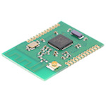

*To contribute to this page, edit the following
[file](https://github.com/Koenkk/zigbee2mqtt.io/blob/master/docgen/device_page_notes.js)*

# Device

| Model | CC2530.ROUTER  |
| Vendor  | Custom devices (DiY)  |
| Description | [CC2530 router](http://ptvo.info/cc2530-based-zigbee-coordinator-and-router-112/) |
| Supports | state, description, type, rssi |
| Picture |  |

## Notes

### Pairing
At first boot it will automatically be in pairing mode and join your network. To reset it into pairing mode power-cycle it three times as follows:

1) power on
2) wait 2sec
3) power off
4) repeat above steps 2 further times
5) power on and wait for it to join your network

## Manual Home Assistant configuration
Although Home Assistant integration through [MQTT discovery](../integration/home_assistant) is preferred,
manual integration is possbile with the following configuration:


### CC2530.ROUTER

```yaml
binary_sensor:
  - platform: "mqtt"
    state_topic: "zigbee2mqtt/<FRIENDLY_NAME>"
    availability_topic: "zigbee2mqtt/bridge/state"
    payload_on: true
    payload_off: false
    value_template: "{{ value_json.state }}"
    device_class: "connectivity"

sensor:
  - platform: "mqtt"
    state_topic: "zigbee2mqtt/<FRIENDLY_NAME>"
    availability_topic: "zigbee2mqtt/bridge/state"
    unit_of_measurement: "-"
    value_template: "{{ value_json.linkquality }}"
```



