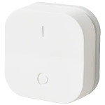

*To contribute to this page, edit the following
[file](https://github.com/Koenkk/zigbee2mqtt.io/blob/master/docgen/device_page_notes.js)*

# IKEA E1743

| Model | E1743  |
| Vendor  | IKEA  |
| Description | TRADFRI ON/OFF switch |
| Supports | on, off, brightness up/down/stop |
| Picture |  |

## Notes


### Binding
The E1743 can be bound to groups using [binding](../information/binding).
It can only be bound to 1 group at a time.

Note that < zigbee2mqtt 1.4 automatically bound this device to group 99.
If you want to bind it to a different group you first have to unbind it from group 99.


### Pairing
Factory reset the light bulb ([video](https://www.youtube.com/watch?v=npxOrPxVfe0)).
After resetting the bulb will automatically connect.

While pairing, keep the bulb close the the CC2531 USB sniffer.

What works is to use (very) short “on’s” and a little bit longer “off’s”.
Start with bulb on, then off, and then 6 “on’s”, where you kill the light as soon as the bulb shows signs of turning on.


## Manual Home Assistant configuration
Although Home Assistant integration through [MQTT discovery](../integration/home_assistant) is preferred,
manual integration is possbile with the following configuration:


### E1743

```yaml
sensor:
  - platform: "mqtt"
    state_topic: "zigbee2mqtt/<FRIENDLY_NAME>"
    availability_topic: "zigbee2mqtt/bridge/state"
    icon: "mdi:toggle-switch"
    value_template: "{{ value_json.click }}"

sensor:
  - platform: "mqtt"
    state_topic: "zigbee2mqtt/<FRIENDLY_NAME>"
    availability_topic: "zigbee2mqtt/bridge/state"
    unit_of_measurement: "%"
    device_class: "battery"
    value_template: "{{ value_json.battery }}"

sensor:
  - platform: "mqtt"
    state_topic: "zigbee2mqtt/<FRIENDLY_NAME>"
    availability_topic: "zigbee2mqtt/bridge/state"
    unit_of_measurement: "-"
    value_template: "{{ value_json.linkquality }}"
```



