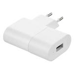

*To contribute to this page, edit the following
[file](https://github.com/Koenkk/zigbee2mqtt.io/blob/master/docgen/device_page_notes.js)*

# IKEA E1746

| Model | E1746  |
| Vendor  | IKEA  |
| Description | TRADFRI signal repeater |
| Supports |  |
| Picture |  |

## Notes


### Pairing
Push the reset button of the device with a paperclip for 5 seconds.
While pairing the LED is flashing/dimming slowly. Once the pairing is finished, the LED stays on.


## Manual Home Assistant configuration
Although Home Assistant integration through [MQTT discovery](../integration/home_assistant) is preferred,
manual integration is possbile with the following configuration:


### E1746

```yaml
sensor:
  - platform: "mqtt"
    state_topic: "zigbee2mqtt/<FRIENDLY_NAME>"
    availability_topic: "zigbee2mqtt/bridge/state"
    unit_of_measurement: "-"
    value_template: "{{ value_json.linkquality }}"
```



