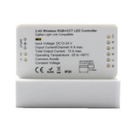

*To contribute to this page, edit the following
[file](https://github.com/Koenkk/zigbee2mqtt.io/blob/master/docgen/device_page_notes.js)*

# Device

| Model | GD-CZ-006  |
| Vendor  | Gledopto  |
| Description | Zigbee LED Driver |
| Supports | on/off, brightness |
| Picture |  |

## Notes

### Pairing
Some of the Gledopto devices are not providing a `modelID`, in that case the modelID `undefined` is shown.
Sometimes it helps to repair the device while keeping it close to the coordinator (less than one meter).

If this fails, the `modelID` has to be set manually in `data/database.db`.
First find out the `modelID` of your devices from
the [Supported devices page](../information/supported_devices.md).
Then open `data/database.db` and add the `modelId` as highlighted in **bold** below.

*{"id":50,"type":"Router","ieeeAddr":"0x00124b0019c606cd","nwkAddr":10828,"manufId":0,
"manufName":"GLEDOPTO","powerSource":"Mains (single phase)",**"modelId":"GL-S-007Z"**,
"epList":[11,13],"status":"offline","joinTime":null,"endpoints":{
"11":{"profId":49246,"epId":11,"devId":528,"inClusterList":[0,3,4,5,6,8,768],
"outClusterList":[],"clusters":{"genBasic":{"dir":{"value":1},"attrs":{}},
"genIdentify":{"dir":{"value":1},"attrs":{}},"genGroups":{"dir":{"value":1},"attrs":{}},
"genScenes":{"dir":{"value":1},"attrs":{}},"genOnOff":{"dir":{"value":1},"attrs":{}},
"genLevelCtrl":{"dir":{"value":1},"attrs":{}},"lightingColorCtrl":{"dir":{"value":1},"attrs":{}}}},
"13":{"profId":49246,"epId":13,"devId":57694,"inClusterList":[4096],"outClusterList":[4096],
"clusters":{"lightLink":{"dir":{"value":3},"attrs":{}}}}},"_id":"geCEMkRqlaMe6muE"}*

