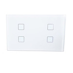

*To contribute tot his page, edit the following
[file](https://github.com/Koenkk/zigbee2mqtt.io/blob/master/docgen/device_page_notes.js)*

# Device

| Model | HGZB-045  |
| Vendor  | Nue / 3A  |
| Description | Smart 4 key scene wall switch |
| Supports | on/off, click |
| Picture |  |

## Notes

None
