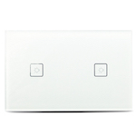

*To contribute to this page, edit the following
[file](https://github.com/Koenkk/zigbee2mqtt.io/blob/master/devices/HGZB-42.md)*

# Device

| Model | HGZB-42  |
| Vendor  | Nue / 3A  |
| Description | Smart 2 Gang Light Switch |
| Supports | on/off |
| Picture |  |

## Notes
### This is *not* a HGZB-042
This device appears to be very similar to the HGZB-**0**42 (notice the extra 0), however the HGZB-42 reports a different 
Zigbee Model and needs a different converter. This device is available from Amazon Australia and 
is "AU Approved".

### Pairing
Remove the glass cover then press and hold the reset button on the board for at least 10 seconds.
The top switch LED should begin to flash. The switch will now attempt to pair to your Zigbee network.
To remove the glass cover, insert a flathead screwdriver into the small hole in the top/bottom of the
switch and pry it open.

### Specifications
The device packaging reports the following specifications:
* Model: HGZB-42
* Voltage: 110v-240V AC 50/60Hz
* Max Load: 300W
* Color: White
* Protocol: ZigBee 3.0
* Manufacturer: Designed and supplied by 3A Smart Home Pty Ltd, Australia

### Added by
This documentation page and support for this device was added by [@jabelone](https://github.com/jabelone) (Jaimyn Mayer).

## Manual Home Assistant configuration
Although Home Assistant integration through [MQTT discovery](../integration/home_assistant) is preferred,
manual integration is possbile with the following configuration:


### HGZB-42

```yaml
switch:
- platform: "mqtt"
state_topic: "zigbee2mqtt/<FRIENDLY_NAME>"
availability_topic: "zigbee2mqtt/bridge/state"
payload_off: "OFF"
payload_on: "ON"
value_template: "{{ value_json.state_top }}"
command_topic: "zigbee2mqtt/<FRIENDLY_NAME>/top/set"

switch:
- platform: "mqtt"
state_topic: "zigbee2mqtt/<FRIENDLY_NAME>"
availability_topic: "zigbee2mqtt/bridge/state"
payload_off: "OFF"
payload_on: "ON"
value_template: "{{ value_json.state_bottom }}"
command_topic: "zigbee2mqtt/<FRIENDLY_NAME>/bottom/set"

sensor:
- platform: "mqtt"
state_topic: "zigbee2mqtt/<FRIENDLY_NAME>"
availability_topic: "zigbee2mqtt/bridge/state"
unit_of_measurement: "-"
value_template: "{{ value_json.linkquality }}"
```



