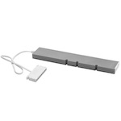

*To contribute to this page, edit the following
[file](https://github.com/Koenkk/zigbee2mqtt.io/blob/master/docgen/device_page_notes.js)*

# Device

| Model | ICPSHC24-30EU-IL-1  |
| Vendor  | IKEA  |
| Description | TRADFRI driver for wireless control (30 watt) |
| Supports | on/off, brightness |
| Picture |  |

## Notes

### Pairing
To factory reset the TRADFRI drivers use a
small pin or paperclip to push the reset button once.

