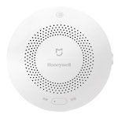

*To contribute to this page, edit the following
[file](https://github.com/Koenkk/zigbee2mqtt.io/blob/master/docgen/device_page_notes.js)*

# Device

| Model | JTQJ-BF-01LM/BW  |
| Vendor  | Xiaomi  |
| Description | MiJia gas leak detector  |
| Supports | gas |
| Picture |  |

## Notes

### Pairing
Press and hold reset button on the device for +- 5 seconds until the
blue light blinks three times, release the reset button (the blue light will blink once more) and wait.

*NOTE: When you fail to pair a device, try replacing the battery, this could solve the problem.*

