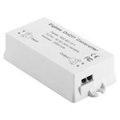

*To contribute tot his page, edit the following
[file](https://github.com/Koenkk/zigbee2mqtt.io/blob/master/docgen/device_page_notes.js)*

# Device

| Model | KS-SM001  |
| Vendor  | Ksentry Electronics  |
| Description | [Zigbee OnOff Controller](http://ksentry.manufacturer.globalsources.com/si/6008837134660/pdtl/ZigBee-module/1162731630/zigbee-on-off-controller-modules.htm) |
| Supports | on/off |
| Picture |  |

## Notes

None
