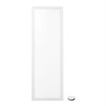

*To contribute tot his page, edit the following
[file](https://github.com/Koenkk/zigbee2mqtt.io/blob/master/docgen/device_page_notes.js)*

# Device

| Model | L1528  |
| Vendor  | IKEA  |
| Description | FLOALT LED light panel, dimmable, white spectrum (30x90 cm) |
| Supports | on/off, brightness, color temperature |
| Picture |  |

## Notes

### Pairing
Factory reset the light bulb ([video](https://www.youtube.com/watch?v=npxOrPxVfe0)).
After resetting the bulb will automatically connect.

While pairing, keep the bulb close the the CC2531 USB sniffer.

What works is to use (very) short “on’s” and a little bit longer “off’s”.
Start with bulb on, then off, and then 6 “on’s”, where you kill the light as soon as the bulb shows signs of turning on.

