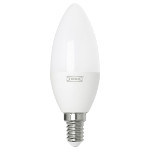

*To contribute to this page, edit the following
[file](https://github.com/Koenkk/zigbee2mqtt.io/blob/master/docgen/device_page_notes.js)*

# IKEA LED1649C5

| Model | LED1649C5  |
| Vendor  | IKEA  |
| Description | TRADFRI LED bulb E12/E14/E17 400 lumen, dimmable warm white, chandelier opal |
| Supports | on/off, brightness |
| Picture |  |

## Notes


### Pairing
Factory reset the light bulb ([video](https://www.youtube.com/watch?v=npxOrPxVfe0)).
After resetting the bulb will automatically connect.

While pairing, keep the bulb close the the CC2531 USB sniffer.

What works is to use (very) short “on’s” and a little bit longer “off’s”.
Start with bulb on, then off, and then 6 “on’s”, where you kill the light as soon as the bulb shows signs of turning on.


## Manual Home Assistant configuration
Although Home Assistant integration through [MQTT discovery](../integration/home_assistant) is preferred,
manual integration is possbile with the following configuration:


### LED1649C5

```yaml
light:
  - platform: "mqtt"
    state_topic: "zigbee2mqtt/<FRIENDLY_NAME>"
    availability_topic: "zigbee2mqtt/bridge/state"
    brightness: true
    schema: "json"
    command_topic: "zigbee2mqtt/<FRIENDLY_NAME>/set"

sensor:
  - platform: "mqtt"
    state_topic: "zigbee2mqtt/<FRIENDLY_NAME>"
    availability_topic: "zigbee2mqtt/bridge/state"
    unit_of_measurement: "-"
    value_template: "{{ value_json.linkquality }}"
```



