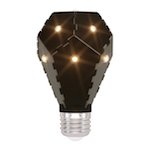

*To contribute to this page, edit the following
[file](https://github.com/Koenkk/zigbee2mqtt.io/blob/master/docgen/device_page_notes.js)*

# Device

| Model | NL08-0800  |
| Vendor  | Nanoleaf  |
| Description | Smart Ivy Bulb E27 |
| Supports | on/off, brightness |
| Picture |  |

## Notes

None
