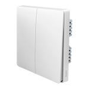

*To contribute tot his page, edit the following
[file](https://github.com/Koenkk/zigbee2mqtt.io/blob/master/docgen/device_page_notes.js)*

# Device

| Model | QBKG03LM  |
| Vendor  | Xiaomi  |
| Description | Aqara double key wired wall switch |
| Supports | release/hold, on/off |
| Picture |  |

## Notes

### Pairing
Press and hold the button on the device for +- 10 seconds
(until the blue light starts blinking and stops blinking), release and wait.

