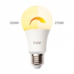

*To contribute to this page, edit the following
[file](https://github.com/Koenkk/zigbee2mqtt.io/blob/master/docgen/device_page_notes.js)*

# Device

| Model | RB 175 W  |
| Vendor  | Innr  |
| Description | E27 Bulb warm dimming |
| Supports | on/off, brightness |
| Picture |  |

## Notes

### Pairing
Factory reset the light bulb ([video](https://www.youtube.com/watch?v=4zkpZSv84H4)).

