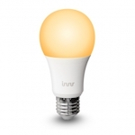

*To contribute tot his page, edit the following
[file](https://github.com/Koenkk/zigbee2mqtt.io/blob/master/docgen/device_page_notes.js)*

# Device

| Model | RB 285 C  |
| Vendor  | Innr  |
| Description | E27 Bulb RGBW |
| Supports | on/off, brightness, color temperature, color xy |
| Picture |  |

## Notes

None
