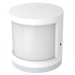

*To contribute to this page, edit the following
[file](https://github.com/Koenkk/zigbee2mqtt.io/blob/master/docgen/device_page_notes.js)*

# Device

| Model | RTCGQ01LM  |
| Vendor  | Xiaomi  |
| Description | MiJia human body movement sensor |
| Supports | occupancy |
| Picture |  |

## Notes

### Pairing
Press and hold the reset button on the device for +- 5 seconds (until the blue light starts blinking).

**IMPORTANT**: Release and start pressing the reset button every second.
This keeps the device awake, otherwise pairing will **fail!**.

*NOTE: When you fail to pair a device, try replacing the battery, this could solve the problem.*

