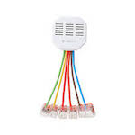

*To contribute tot his page, edit the following
[file](https://github.com/Koenkk/zigbee2mqtt.io/blob/master/docgen/device_page_notes.js)*

# Device

| Model | SCM-5ZBS  |
| Vendor  | Climax  |
| Description | Roller shutter |
| Supports | open/close |
| Picture |  |

## Notes

None
