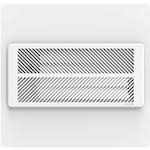

*To contribute tot his page, edit the following
[file](https://github.com/Koenkk/zigbee2mqtt.io/blob/master/docgen/device_page_notes.js)*

# Device

| Model | SV01  |
| Vendor  | Keen Home  |
| Description | Smart vent |
| Supports | open, close, position, temperature, pressure, battery |
| Picture |  |

## Notes

None
