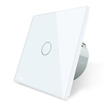

# Device

| Model | TI0001  |
| Vendor  | Livolo  |
| Description | Zigbee switch (1 and 2 gang) [work in progress](https://github.com/Koenkk/zigbee2mqtt/issues/592) |
| Supports | on/off |
| Picture |  |

## Notes

None
