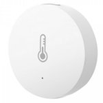

*To contribute to this page, edit the following
[file](https://github.com/Koenkk/zigbee2mqtt.io/blob/master/docgen/device_page_notes.js)*

# Device

| Model | WSDCGQ01LM  |
| Vendor  | Xiaomi  |
| Description | MiJia temperature & humidity sensor  |
| Supports | temperature and humidity |
| Picture |  |

## Notes

### Pairing
Press and hold the reset button on the device for +- 5 seconds (until the blue light starts blinking).

**IMPORTANT**: Release and start pressing the reset button every second.
This keeps the device awake, otherwise pairing will **fail!**.

*NOTE: When you fail to pair a device, try replacing the battery, this could solve the problem.*

### Device type specific configuration
*[How to use device type specific configuration](../configuration/device_specific_configuration.md)*

* `temperature_precision`: Controls the precision of `temperature` values,
e.g. `0`, `1` or `2`; default `2`.

* `humidity_precision`: Controls the precision of `humidity` values, e.g. `0`, `1` or `2`; default `2`.

