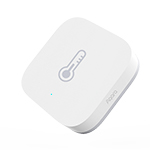

*To contribute to this page, edit the following
[file](https://github.com/Koenkk/zigbee2mqtt.io/blob/master/docgen/device_page_notes.js)*

# Device

| Model | WSDCGQ11LM  |
| Vendor  | Xiaomi  |
| Description | Aqara temperature, humidity and pressure sensor |
| Supports | temperature, humidity and pressure |
| Picture |  |

## Notes

### Pairing
Press and hold reset button on the device for +- 5 seconds until the
blue light blinks three times, release the reset button (the blue light will blink once more) and wait.

*NOTE: When you fail to pair a device, try replacing the battery, this could solve the problem.*

### Device type specific configuration
*[How to use device type specific configuration](../configuration/device_specific_configuration.md)*

* `temperature_precision`: Controls the precision of `temperature` values,
e.g. `0`, `1` or `2`; default `2`.

* `humidity_precision`: Controls the precision of `humidity` values, e.g. `0`, `1` or `2`; default `2`.

* `pressure_precision`: Controls the precision of `pressure` values, e.g. `0` or `1`; default `1`.

