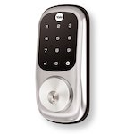

*To contribute tot his page, edit the following
[file](https://github.com/Koenkk/zigbee2mqtt.io/blob/master/docgen/device_page_notes.js)*

# Device

| Model | YRD226HA2619  |
| Vendor  | Yale  |
| Description | Assure lock |
| Supports | lock/unlock, battery |
| Picture |  |

## Notes

None
