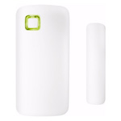

*To contribute tot his page, edit the following
[file](https://github.com/Koenkk/zigbee2mqtt.io/blob/master/docgen/device_page_notes.js)*

# Device

| Model | ZCTS-808  |
| Vendor  | Trust  |
| Description | Wireless contact sensor |
| Supports | contact |
| Picture |  |

## Notes

### Pairing
When pairing the sensor with Zigbee2MQTT,
keep opening and closing the sensor (pull/insert the sensor parts next to eachother) for 10 seconds,
otherwise device will fall asleep before it gets fully configured and will not send state changes.

