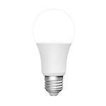

*To contribute to this page, edit the following
[file](https://github.com/Koenkk/zigbee2mqtt.io/blob/master/docgen/device_page_notes.js)*

# Device

| Model | ZNLDP12LM  |
| Vendor  | Xiaomi  |
| Description | Aqara smart LED bulb |
| Supports | on/off, brightness, color temperature |
| Picture |  |

## Notes

None
