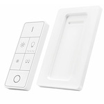

*To contribute tot his page, edit the following
[file](https://github.com/Koenkk/zigbee2mqtt.io/blob/master/docgen/device_page_notes.js)*

# Device

| Model | ZYCT-202  |
| Vendor  | Trust  |
| Description | Remote control |
| Supports | on, off, stop, up-press, down-press |
| Picture |  |

## Notes

### Pairing
Factory reset the remote by holding the 0 (off) button for +-20 seconds.
To establish a connection keep the remote within 2 meters from the hub.
Press and hold the smart group button (button with two bulbs) and wait until the lights, below the channels, flash.

