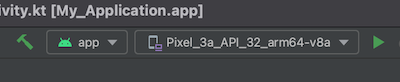
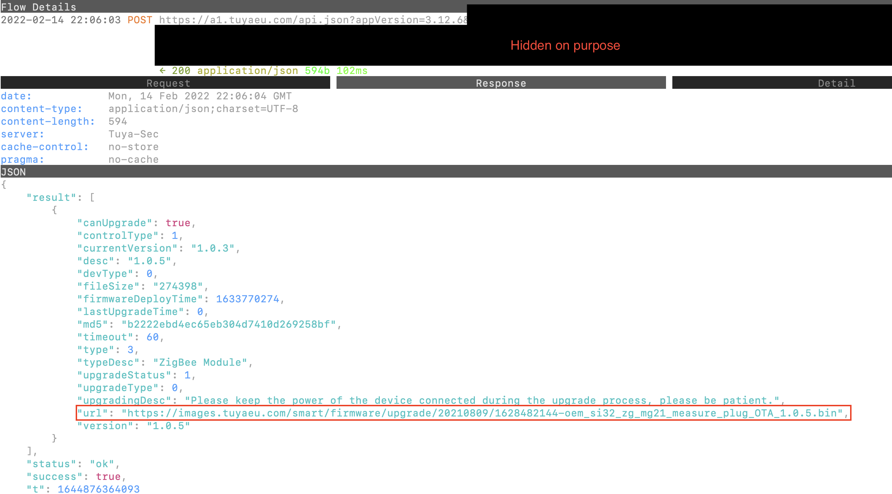

# Get Tuya and Xiaomi OTA url

This guide explains how to retrieve a TuYa or Xiaomi OTA file for your device. This file can then be used to update your TuYa/Xiaomi device via Zigbee2MQTT.

Prerequisites:

-   Docker
-   TuYa bridge or Xiaomi gateway
-   [Android Studio](https://developer.android.com/studio)

## Step 1: running the proxy

Execute the following command: `docker run --rm -it -p 8080:8080 mitmproxy/mitmproxy`

## Step 2: setup the Android emulator

Start Android Studio and create a new empty project:

1. File -> New -> New Project...
1. Phone and Tablet -> Empty Activity -> Next
1. Finish
1. Click on the emulator ("Pixel*3a*..." in the case below) -> Device Manager   
1. Click on the pencil icon of the device, under "Show Advanced Settings" change the "Internal Storage" to "2000". Click "Finish".
1. Start the emulator by clicking the play icon.   
1. On the emulator, go to Settings -> Network & internet -> Internet -> AndroidWifi -> Edit (pencil right top) -> Advanced options -> Proxy -> Manual. For proxy host name fill in the IP address of your computer (e.g. 192.168.2.145), for port fill in 8080. Save.
1. Open Chrome on the emulator, go to http://mitm.it and click on "Get mitmproxy-ca-cert.cer" under Android.
1. Go to settings again, Security -> Encryption & credentials -> Install a certificate -> CA certificate -> Install anyway -> Drawer icon -> Downloads -> click on the downloaded certificate.

## Step 3a: get the TuYa OTA url

1. Download the TuYa app apk from [this link](https://aapks.com/download.php?dl=48267761) (IMPORTANT: newer version don't work, tested with 3.12.6). Drag the downloaded apk on the emulator (which will install it).
1. Open the TuYa Smart Life app in the emulator, log in with your account
1. Make sure the TuYa bridge + the device you want to get the OTA of is already coupled to your account, this cannot be done from the emulator so use your phone for this. Make sure to use the same app on your phone, otherwise the device will not show up (e.g. for iOS use [this](https://apps.apple.com/nl/app/smart-life-smart-living/id1115101477), [**not this**](https://apps.apple.com/nl/app/tuya-smart/id1034649547)).
1. Click on the device -> edit (pencil icon right top). Click "Check for Firmware Upgrade".
1. If an firmware upgrade is available, quickly go back to the output of mitm (step 1), click on the latest request (yes you can click in the console window). This will show your the OTA url (see red box below).
    - Tip: to go back to the overview of requests press the `Q` key on your keyboard.

## Step 3b: get the Xiaomi OTA url

NOTE: This only works for native Aqara gateways which can be connected to the Aqara Home app (not the Xiaomi home app!)

-   Works: ZHWG16LM/HE1-G0, ZHWG15LM, ZHWG12LM
-   Doesn't work: ZNDMWG03LM, DGNWG02LM

1. Download the Aqara home app apk from [this link](https://apkpure.com/nl/aqara-home/com.lumiunited.aqarahome), tested with version 2.2.5. Drag the downloaded apk on the emulator (which will install it).
1. Open the Aqara home app in the emulator, log in with your account
1. Make sure the Aqara gateway + the device you want to get the OTA of is already coupled to your account, this cannot be done from the emulator so use your phone for this.
1. Click on your device and check for a firmware upgrade.
1. If an firmware upgrade is available, quickly go back to the output of mitm (step 1), click on the latest request (yes you can click in the console window). This will show your the OTA url (see screenshot of step 3a).

## Step 4: add OTA to zigbee-ota

1. Follow [this guide](https://github.com/koenkk/zigbee-ota#adding-new-and-updating-existing-ota-files) to add the OTA to the [zigbee-OTA](https://github.com/koenkk/zigbee-ota) repository.
1. Enable the ota by adding `ota: ota.zigbeeOTA` to your device definition ([example](https://github.com/Koenkk/zigbee-herdsman-converters/blob/3e45f8f13b419ea8ce33fb3d30b11f5ac1bdec08/devices/tuya.js#L1172)).
