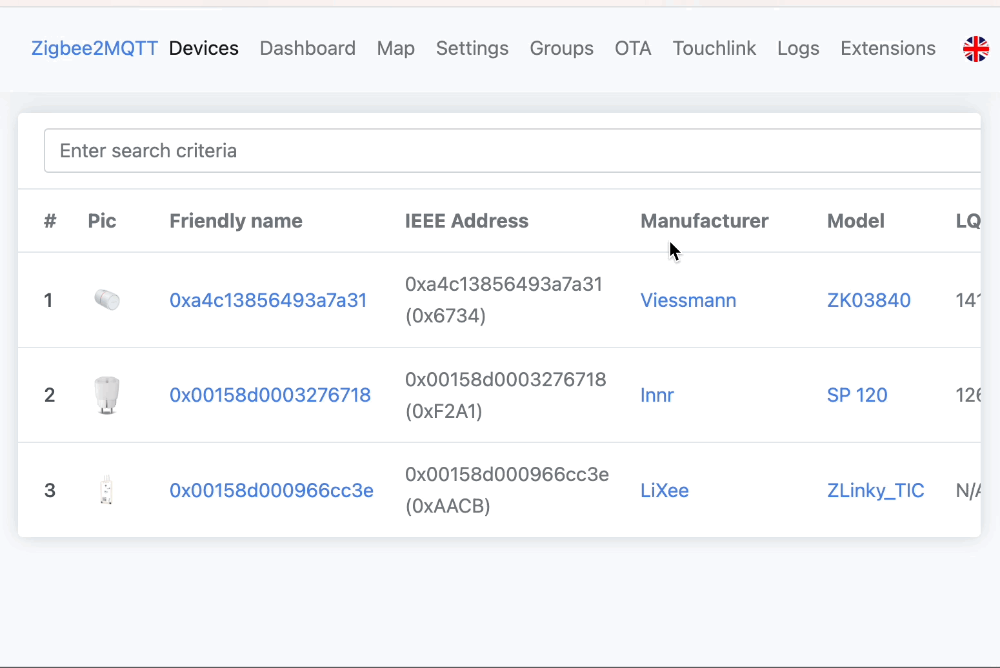

# Support new devices

Zigbee2MQTT uses [zigbee-herdsman-converters](https://github.com/Koenkk/zigbee-herdsman-converters) to parse messages to and from devices.

This page will guide you through the process of adding support for new devices to [zigbee-herdsman-converters](https://github.com/Koenkk/zigbee-herdsman-converters).

In case you require any help feel free to create an [issue](https://github.com/Koenkk/zigbee2mqtt/issues).

**Before** starting, first check if your device is not already supported in the Zigbee2MQTT dev branch! This can be done by checking the [changelog](https://gist.github.com/Koenkk/bfd4c3d1725a2cccacc11d6ba51008ba#new-supported-devices) of the dev branch.

## Instructions

### 1. Pairing the device with Zigbee2MQTT

The first step is to pair the device with Zigbee2MQTT. It should be possible to pair your unsupported device out of the box because Zigbee2MQTT can pair with any Zigbee device. You need to find out how to bring your device into pairing mode, most of the time via a factory reset.

Once you successfully paired the device you will see something like:

```
Zigbee2MQTT:info  2019-11-09T12:19:56: Successfully interviewed '0x00158d0001dc126a', device has successfully been paired
Zigbee2MQTT:warn  2019-11-09T12:19:56: Device '0x00158d0001dc126a' with Zigbee model 'lumi.sens' and manufacturer name 'some_name' is NOT supported, please follow https://www.zigbee2mqtt.io/how-tos/support_new_devices.html
```

::: tip
Make sure that joining is enabled, otherwise new devices cannot join the network.
:::

### 2. Creating the external definition

When pairing an unsupported device with Zigbee2MQTT, it will attempt to discover features supported by this device. To check what has already been discovered, go to the "Zigbeee2MQTT frontend -> device -> Exposes tab". See if the exposed features work by checking if values are reported and/or it's controllable (in case of e.g. a light).
Note that feature discovery is still WIP, not all features may be discovered or it may not be possible discovery all features due to a non-standard implementation of the device (commonly the case for Tuya devices).

Next generate the external definition by going to the device -> "Dev console" tab and press "Generate external definition".



By default, the external definition will use modern extends.
This is done by mapping them to exposed Zigbee clusters.
But this approach only works well when devices implement the Zigbee ZCL specification.
If all features work and all the expected features are there, you are lucky and can continue with step 3.
If not, we have to extend the external definition.

::: tip
Depending on the device, it could be possible to extend the definition using other modern extends.
This process is recommended and is generally easier.
:::

### 2.1. Extending the external definition

To extend the generated external definition, save it next to the Zigbee2MQTT `configuration.yaml`. In this example we will call it `WSDCGQ01LM.js` (make sure it ends with `.js`). Add the lines like described below:

```js
const {} = require('zigbee-herdsman-converters/lib/modernExtend');
// Add the lines below
const fz = require('zigbee-herdsman-converters/converters/fromZigbee');
const tz = require('zigbee-herdsman-converters/converters/toZigbee');
const exposes = require('zigbee-herdsman-converters/lib/exposes');
const reporting = require('zigbee-herdsman-converters/lib/reporting');
const ota = require('zigbee-herdsman-converters/lib/ota');
const utils = require('zigbee-herdsman-converters/lib/utils');
const globalStore = require('zigbee-herdsman-converters/lib/store');
const e = exposes.presets;
const ea = exposes.access;

const definition = {
    zigbeeModel: ['lumi.sens'],
    model: 'WSDCGQ01LM', // Update this with the real model of the device (written on the device itself or product page)
    vendor: 'Xiaomi', // Update this with the real vendor of the device (written on the device itself or product page)
    description: 'MiJia temperature & humidity sensor', // Description of the device, copy from vendor site. (only used for documentation and startup logging)
    extend: [],
    fromZigbee: [], // We will add this later
    toZigbee: [], // Should be empty, unless device can be controlled (e.g. lights, switches).
    exposes: [e.battery(), e.temperature(), e.humidity()], // Defines what this device exposes, used for e.g. Home Assistant discovery and in the frontend
};

module.exports = definition;
```

Now set the Zigbee2MQTT `log_level` to `debug` and enable the external definition by adding the following to your Zigbee2MQTT `configuration.yaml`.

```yaml
advanced:
    log_level: debug
external_converters:
    - WSDCGQ01LM.js
```

Once finished, restart Zigbee2MQTT and trigger some actions on the device. You will see messages like:

```
Zigbee2MQTT:debug  2019-11-09T12:24:22: No converter available for 'WSDCGQ01LM' with cluster 'msTemperatureMeasurement' and type 'attributeReport' and data '{"measuredValue":2512}'
```

If your device is not reporting anything, it could be that this device requires additional configuration. This can be done by adding a `configure:` section. It may help to look at similar [devices](https://github.com/Koenkk/zigbee-herdsman-converters/blob/master/src/devices).

::: tip
If your device is advertised as Tuya compatible or reports anything with `manuSpecificTuya` additional instructions for adding your device can be found [here](./02_support_new_tuya_devices.md).
:::

In case your device does not report anything out of the blue, the Clusters page at Zigbee2MQTT's frontend (found under the device in the dashboard) also exposes the clusters.

Some basic external converter examples:

-   [Bulb (light)](https://github.com/Koenkk/zigbee2mqtt.io/blob/master/docs/externalConvertersExample/light.js)
-   [Plug (switch)](https://github.com/Koenkk/zigbee2mqtt.io/blob/master/docs/externalConvertersExample/switch.js)
-   [Advanced example](https://github.com/Koenkk/zigbee2mqtt.io/blob/master/docs/externalConvertersExample/freepad_ext.js)
-   Definitions of already supported devices can be found [here](https://github.com/Koenkk/zigbee-herdsman-converters/tree/master/src/devices). It may help to look at devices from the same vendor or type.

### 2.2. Adding converter(s) for your device

In order to parse the messages of your Zigbee device we need to add converter(s). Existing converters can probably be reused, those can be found [here](https://github.com/Koenkk/zigbee-herdsman-converters/blob/master/src/converters/fromZigbee.ts).

For e.g. the following message we could use the already existing [`fz.temperature` converter](https://github.com/Koenkk/zigbee-herdsman-converters/blob/4a8d546d9c1150d81e42d56a85e2315c32c4ed11/src/converters/fromZigbee.ts#L397):

```
Zigbee2MQTT:debug  2019-11-09T12:24:22: No converter available for 'WSDCGQ01LM' with cluster 'msTemperatureMeasurement' and type 'attributeReport' and data '{"measuredValue":2512}'
```

Now update your external converter.

```js
const {} = require('zigbee-herdsman-converters/lib/modernExtend');
const fz = require('zigbee-herdsman-converters/converters/fromZigbee');
const tz = require('zigbee-herdsman-converters/converters/toZigbee');
const exposes = require('zigbee-herdsman-converters/lib/exposes');
const reporting = require('zigbee-herdsman-converters/lib/reporting');
const ota = require('zigbee-herdsman-converters/lib/ota');
const utils = require('zigbee-herdsman-converters/lib/utils');
const globalStore = require('zigbee-herdsman-converters/lib/store');
const e = exposes.presets;
const ea = exposes.access;

const definition = {
    zigbeeModel: ['lumi.sens'],
    model: 'WSDCGQ01LM',
    vendor: 'Xiaomi',
    description: 'MiJia temperature & humidity sensor',
    extend: [],
    fromZigbee: [fz.temperature], // <-- added here all clusters reported from zigbee
    toZigbee: [], // <-- add here all clusters to send commands to zigbee
    exposes: [e.battery(), e.temperature(), e.humidity()], // <-- this will define which fields will be exposed in the definition message to configure a frontend (e.g. the Z2M frontend, Home Assistant, Domoticz)
};

module.exports = definition;
```

Repeat until your device does not produce any more log messages like: `2018-5-1 18:19:41 WARN No converter available for 'WSDCGQ01LM' with....`

If none of the existing converters fit you can add custom ones, an external converter example for this can be found [here](https://github.com/Koenkk/zigbee2mqtt.io/blob/master/docs/externalConvertersExample/freepad_ext.js).

### 2.3 Using modern extend

This exact same definition could be achieved using modern extends.

```js
const {temperature, humidity, battery} = require('zigbee-herdsman-converters/lib/modernExtend');
// No other imports are necessary.

const definition = {
    zigbeeModel: ['lumi.sens'],
    model: 'WSDCGQ01LM',
    vendor: 'Xiaomi',
    description: 'MiJia temperature & humidity sensor',
    extend: [
        // Modern extends are incapsulating fromZigbee, toZigbee, exposes and more.
        temperature(),
        humidity(),
        battery(),
    ],
};

module.exports = definition;
```

### 3. Add device picture to zigbee2mqtt.io documentation

To make sure a picture is available for this device on the supported devices page and in the frontend:

1. Clone [zigbee2mqtt.io](https://github.com/Koenkk/zigbee2mqtt.io)
2. Add a device picture (`.png`, 512x512, transparent background) to `public/images/devices`. Use the [Adobe Express Remove Background tool](https://new.express.adobe.com/tools/remove-background) to make the background transparent.
3. **_Optional:_** Add a markdown file for your device to `docs/devices`, use the `model` property of your definition as the filename. Most of the contents of this file will be auto-generated through docgen but you can add your own notes in a notes section. Do not use h1 or h2 heading within "## Notes"-Section.
    > > \<!-- Notes BEGIN --><br> >> \## Notes<br>
    > > ...<br> >> \<!-- Notes END -->
4. Create a Pull Request to [zigbee2mqtt.io](https://github.com/Koenkk/zigbee2mqtt.io).

On the next release of Zigbee2MQTT, the documentation will be updated and your device file will be linked in `../../supported-devices.md` automatically.

### 4. Done!

Now it's time to submit a pull request to [zigbee-herdsman-converters](https://github.com/Koenkk/zigbee-herdsman-converters) so this device is supported out of the box by Zigbee2MQTT. This can be done by adding the definition to the [vendor file](https://github.com/Koenkk/zigbee-herdsman-converters/tree/master/src/devices) of your device. :smiley:
