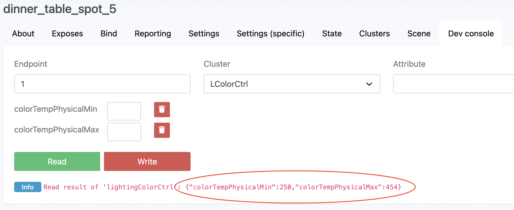

# Support new devices
Zigbee2MQTT uses [zigbee-herdsman-converters](https://github.com/Koenkk/zigbee-herdsman-converters) to parse messages to and from devices.

This page will guide you through the process of adding support for new devices to [zigbee-herdsman-converters](https://github.com/Koenkk/zigbee-herdsman-converters).

In case you require any help feel free to create an [issue](https://github.com/Koenkk/zigbee2mqtt/issues).

**Before** starting, first check if your device is not already supported in the Zigbee2MQTT dev branch! This can be done by searching on your Zigbee model (see step 1 below) in any of the files [here](https://github.com/Koenkk/zigbee-herdsman-converters/tree/master/src/devices).

## Instructions
### 1. Pairing the device with Zigbee2MQTT
The first step is to pair the device with Zigbee2MQTT. It should be possible to pair your unsupported device out of the box because Zigbee2MQTT can pair with any Zigbee device. You need to find out how to bring your device into pairing mode, most of the time via a factory reset.

Once you successfully paired the device you will see something like:
```
Zigbee2MQTT:info  2019-11-09T12:19:56: Successfully interviewed '0x00158d0001dc126a', device has successfully been paired
Zigbee2MQTT:warn  2019-11-09T12:19:56: Device '0x00158d0001dc126a' with Zigbee model 'lumi.sens' and manufacturer name 'some_name' is NOT supported, please follow https://www.zigbee2mqtt.io/how-tos/support_new_devices.html
```

::: tip
Make sure that joining is enabled, otherwise new devices cannot join the network.
:::

### 2. Adding your device
The next step is to create an external converter file. This file has to be created next to the `configuration.yaml`, in this example we will call it `WSDCGQ01LM.js` (make sure it ends with `.js`). In order to provide support for e.g. the `lumi.sens` from step 1 we would add the following to this file:

```js
const fz = require('zigbee-herdsman-converters/converters/fromZigbee');
const tz = require('zigbee-herdsman-converters/converters/toZigbee');
const exposes = require('zigbee-herdsman-converters/lib/exposes');
const reporting = require('zigbee-herdsman-converters/lib/reporting');
const extend = require('zigbee-herdsman-converters/lib/extend');
const e = exposes.presets;
const ea = exposes.access;

const definition = {
    zigbeeModel: ['lumi.sens'], // The model ID from: Device with modelID 'lumi.sens' is not supported.
    model: 'WSDCGQ01LM', // Vendor model number, look on the device for a model number
    vendor: 'Xiaomi', // Vendor of the device (only used for documentation and startup logging)
    description: 'MiJia temperature & humidity sensor', // Description of the device, copy from vendor site. (only used for documentation and startup logging)
    fromZigbee: [], // We will add this later
    toZigbee: [], // Should be empty, unless device can be controlled (e.g. lights, switches).
    exposes: [e.battery(), e.temperature(), e.humidity()], // Defines what this device exposes, used for e.g. Home Assistant discovery and in the frontend
};

module.exports = definition;
```

Now set the Zigbee2MQTT `log_level` to `debug` and enable the external converter by adding the following to your Zigbee2MQTT `configuration.yaml`.

```yaml
advanced:
  log_level: debug
external_converters:
  - WSDCGQ01LM.js
```

Once finished, restart Zigbee2MQTT and trigger some actions on the device. You will see messages like:
```
Zigbee2MQTT:debug  2019-11-09T12:24:22: No converter available for 'WSDCGQ01LM' with cluster 'msTemperatureMeasurement' and type 'attributeReport' and data '{"measuredValue":2512}'
```

If your device is not reporting anything, it could be that this device requires additional configuration. This can be done by adding a `configure:` section. It may help to look at similar [devices](https://github.com/Koenkk/zigbee-herdsman-converters/blob/master/src/devices).

::: tip
If your device is advertised as TuYa compatible or reports anything with `manuSpecificTuya` additional instructions for adding your device can be found [here](./02_support_new_tuya_devices.md).
:::

In case your device does not report anything out of the blue, the Clusters page at Zigbee2MQTT's frontend (found under the device in the dashboard) also exposes the clusters.

Some basic external converter examples:
- [Bulb (light)](https://github.com/Koenkk/zigbee2mqtt.io/blob/master/docs/externalConvertersExample/light.js)
- [Plug (switch)](https://github.com/Koenkk/zigbee2mqtt.io/blob/master/docs/externalConvertersExample/switch.js)
- [Advanced example](https://github.com/Koenkk/zigbee2mqtt.io/blob/master/docs/externalConvertersExample/freepad_ext.js)
- Definitions of already supported devices can be found [here](https://github.com/Koenkk/zigbee-herdsman-converters/blob/master/devices). It may help to look at devices from the same vendor or type.

### 3. Adding converter(s) for your device
In order to parse the messages of your Zigbee device we need to add converter(s). Existing converters can probably be reused, those can be found [here](https://github.com/Koenkk/zigbee-herdsman-converters/blob/master/src/converters/fromZigbee.js).

For e.g. the following message we could use the already existing [`fz.temperature` converter](https://github.com/Koenkk/zigbee-herdsman-converters/blob/e1f8b3c537a99891dfb451734e52bfd2da643a20/src/converters/fromZigbee.js#L372):
```
Zigbee2MQTT:debug  2019-11-09T12:24:22: No converter available for 'WSDCGQ01LM' with cluster 'msTemperatureMeasurement' and type 'attributeReport' and data '{"measuredValue":2512}'
```

Now update your external converter.
```js
const fz = require('zigbee-herdsman-converters/converters/fromZigbee');
const tz = require('zigbee-herdsman-converters/converters/toZigbee');
const exposes = require('zigbee-herdsman-converters/lib/exposes');
const reporting = require('zigbee-herdsman-converters/lib/reporting');
const extend = require('zigbee-herdsman-converters/lib/extend');
const e = exposes.presets;
const ea = exposes.access;

const definition = {
    zigbeeModel: ['lumi.sens'],
    model: 'WSDCGQ01LM',
    vendor: 'Xiaomi',
    description: 'MiJia temperature & humidity sensor',
    fromZigbee: [fz.temperature], // <-- added here all clusters reported from zigbee
    toZigbee: [], // <-- add here all clusters to send commands to zigbee
    exposes: [e.battery(), e.temperature(), e.humidity()], // <-- this will define which fields will be exposed in the definition message to configure a front end (e.g. the z2m frontend, Home Assistant, Domoticz)
};

module.exports = definition;
```

Repeat until your device does not produce any more log messages like: `2018-5-1 18:19:41 WARN No converter available for 'WSDCGQ01LM' with....`

If none of the existing converters fit you can add custom ones, an external converter example for this can be found [here](https://github.com/Koenkk/zigbee2mqtt.io/blob/master/docs/externalConvertersExample/freepad_ext.js).

#### 3.1 Retrieving color temperature range (only required for lights which support color temperature)
If your device is a light and supports color temperature you need to define the color temperature range. This range indicates the minimum and maximum color temperature values the light supports. This can be retrieved by clicking on your device in the frontend, go to "Dev console". For cluster select `LColorCtrl`, for attribute `colorTempPhysicalMin` and `colorTempPhysicalMax`, after that click on "Read". Now the min/max color temperature will be read as marked below



Alternatively this can be retrieved from the light by sending to `zigbee2mqtt/DEVICE_FRIENDLY_NAME/set` with payload `{"read": {"cluster": "lightingColorCtrl", "attributes": ["colorTempPhysicalMin", "colorTempPhysicalMax"]}}`

The result will be logged to the Zigbee2MQTT log, e.g.

```
Zigbee2MQTT:info  2021-03-21 21:10:40: Read result of 'lightingColorCtrl': {"colorTempPhysicalMin":153,"colorTempPhysicalMax":454}
```

In the above example set `colorTempRange` to `{colorTempRange: [153, 454]}`, e.g.:

```js
const definition = {
    zigbeeModel: ['myZigbeeModel'],
    model: 'myModel',
    vendor: 'myVendor',
    description: 'Super bulb',
    extend: extend.light_onoff_brightness_colortemp({colorTempRange: [153, 454]}), // <---
},
```

### 4. Add device picture to zigbee2mqtt.io documentation
To make sure a picture is available for this device on the supported devices page and in the frontend:

1. Clone [zigbee2mqtt.io](https://github.com/Koenkk/zigbee2mqtt.io)
2. Add a device picture (`.jpg`, 150x150) to `public/images/devices`.
3. ***Optional:*** Add a markdown file for your device to `docs/devices`, use the `model` property of your definition as the filename.  Most of the contents of this file will be auto-generated through docgen but you can add your own notes in a notes section. Do not use h1 or h2 heading within "## Notes"-Section.
>> \<!-- Notes BEGIN --><br>
>> \## Notes<br>
>> ...<br>
>> \<!-- Notes END -->
4. Create a Pull Request to [zigbee2mqtt.io](https://github.com/Koenkk/zigbee2mqtt.io).

On the next release of Zigbee2MQTT, the documentation will be updated and your device file will be linked in `../../supported-devices.md` automatically.

### Done!
Now it's time to submit a pull request to [zigbee-herdsman-converters](https://github.com/Koenkk/zigbee-herdsman-converters) so this device is supported out of the box by Zigbee2MQTT. This can be done by adding the definition to the [vendor file](https://github.com/Koenkk/zigbee-herdsman-converters/tree/master/src/devices) of your device. :smiley:
