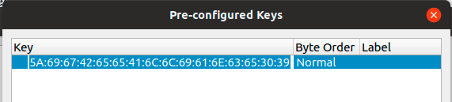
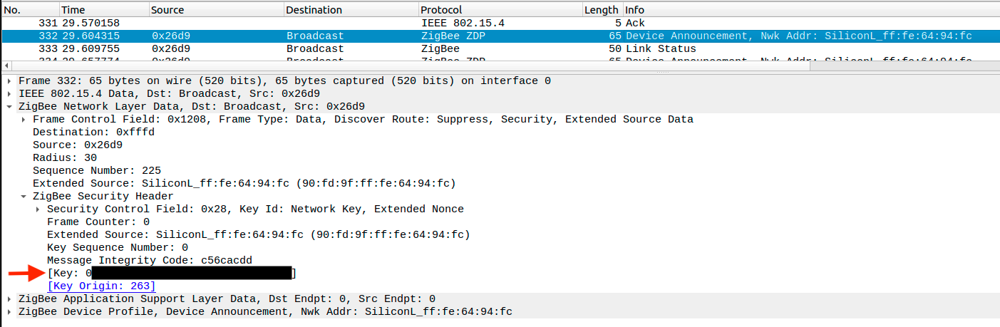
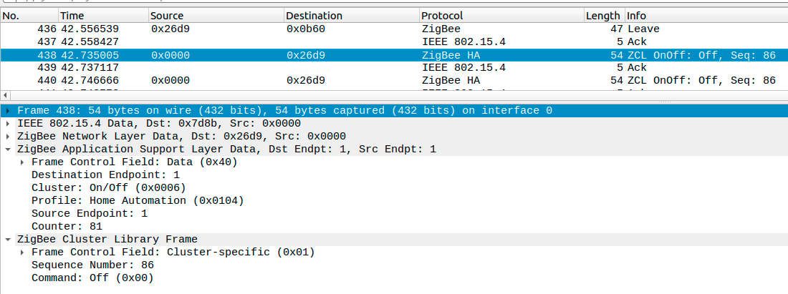

---
---

# Sniff Zigbee traffic

Sniffing Zigbee traffic can be handy sometimes. E.g. when you want to analyze the commands used by a device.

## Configuring Wireshark

### Linux

If using Linux, install from the package manager.

For APT-based distributions:

```
sudo apt install -y wireshark
```

### Windows

Download and install [Wireshark](https://www.wireshark.org/download.html) (documentation available on the same page).

Download and install [Npcap](https://nmap.org/npcap/) and make sure you select to install the "Npcap Loopback Adapter" when installing. It shouldn't matter whether or not you use Winpcap compatibility mode.

### Usage

Use Adapter for loopback traffic capture. Then set the Zigbee protocol filter: `udp.port==17754` (default ZEP port) to only see Zigbee traffic.

Wireshark will start and log the Zigbee messages once the sniffer is started. As these messages are encrypted we need to add 2 encryption keys. The first one is the Trust Center link key, which is the same for (almost) every Zigbee network. The second one is the network encryption key (Transport Key).

::: tip TIP
If using Wireshark on a different machine (different IP address), depending on your setup, you may get a lot of `ICMP: Destination unreachable (Port unreachable)` during the capture. You can use the filter `udp.port==17754 && !icmp` to get rid of them.
:::

::: tip TIP
You can find details on various customizations for Wireshark in the ZSmart Systems sniffer [PDF - page 7](https://www.opensmarthouse.org/files/download/ZigBeeWiresharkSniffer.pdf). **Coloring rules are processed in order until a match is found. You may need to re-order `UDP` to the bottom to get the Zigbee rules to apply properly.**
:::

### Adding the Trust Center link key

Add the Trust Center link key by going to to `Edit > Preferences > Protocols > ZigBee`.

Set `Security Level` to `AES-128 Encryption, 32-bit Integrity Protection`.

Next click on `Pre-configured keys > Edit`. Click on _+_ and add `5A:69:67:42:65:65:41:6C:6C:69:61:6E:63:65:30:39` with Byte Order `Normal`.

_NOTE: The Hue bridge uses a [different Trust Center link key](https://peeveeone.com/2016/11/breakout-breakthrough/)_



### Adding the Network key

Next we need to figure out the network encryption key (Transport Key).

By default, if you haven't changed `network_key` in your `configuration.yaml` this will be `01:03:05:07:09:0B:0D:0F:00:02:04:06:08:0A:0C:0D`.

If you changed your `network_key` (used `GENERATE`), you need to convert it to the format accepted by Wireshark. There are three ways to do this:

1. Grab the value under `network_key` > `key` from `coordinator_backup.json` and separate every 2-character with `:`. E.g. `01030507090b0d0f00020406080a0c0d` -> `01:03:05:07:09:0b:0d:0f:00:02:04:06:08:0a:0c:0d`.

2. Grab the value under `network_key` from `configuration.yaml` and convert each number into its 2-digit hexadecimal value, and combine them all with `:` between. E.g. `[1, 3, 5, 7, 9, 11, 13, 15, 0, 2, 4, 6, 8, 10, 12, 13]` -> `01:03:05:07:09:0B:0D:0F:00:02:04:06:08:0A:0C:0D`.

    You can paste your `network_key` below to convert it. Note: The conversion is done locally; your key never leaves your browser.
    <NetworkKeyConverter/>

3. If you don't want to translate the numbers, the network encryption key is also exposed when a device joins the network. Pair a new device to the network (or re-pair an existing one) and grab the message where the Info is _Device Announcement...._. Open the message and expand _ZigBee Network Layer Data_ -> _ZigBee Security Header_.

    

Copy the key value, as shown above and go to `Edit > Preferences > Protocols > ZigBee > Pre-configured keys > Edit` and add the key with Byte Order `Normal`.

Now Wireshark is able to decrypt the messages. When e.g. turning on a light you will see a message similar to:



## With CC2531

### Prerequisites

-   Computer
    -   Ubuntu / Debian machine (tested with Ubuntu 18.04 / 18.10 and Debian 10)
    -   Windows machine (tested with Windows 10)
-   CC2531 adapter

### 1. Flashing the CC2531 adapter

The CC2531 needs to be flashed with a sniffer firmware. Flash the firmware using the instructions from [Flashing the CC2531](../../guide/adapters/flashing/flashing_the_cc2531.md).

#### Linux

The firmware is included with [PACKET-SNIFFER](http://www.ti.com/tool/PACKET-SNIFFER) (not **PACKET-SNIFFER-2!**). Download PACKET-SNIFFER. As the sniffer firmware is only available in the windows installer we need to extract the hex file. This would require 7zip (p7zip-full or p7zip-plugins package depending on distributions)

```bash
unzip swrc045z.zip -d PACKET-SNIFFER
7z e PACKET-SNIFFER/Setup_SmartRF_Packet_Sniffer_2.18.0.exe bin/general/firmware/sniffer_fw_cc2531.hex
sudo <path-to>/cc-tool -e -w <path-to>/sniffer_fw_cc2531.hex
```

#### Windows (and possibly Ubuntu)

For Windows this firmware is included with [ZBOSS](https://dsr-iot.com/downloads). Register an account and download _Zigbee sniffer package rev. 2.0_. Included in the ZIP file is the firmware in subfolder `zb_sniffer_bin\zb_sniffer_target\CC2531 USB dongle\zboss_sniffer.hex`. Please note that ZBOSS is also available for Ubuntu 64-bit.

### 2. Installing required tools

#### Linux

For APT-based distributions:

```bash
cd /opt
sudo apt install -y libusb-1.0-0-dev wireshark
curl -L https://github.com/homewsn/whsniff/archive/v1.3.tar.gz | tar zx
cd whsniff-1.3
make
sudo make install
```

#### Windows

Ensure you have Wireshark installed (see [Configuring Wireshark](#configuring-wireshark) above) and ZBOSS downloaded and extracted.

### 3. Sniffing traffic

#### Linux

Start wireshark

```bash
sudo whsniff -c ZIGBEE_CHANNEL_NUMBER | wireshark -k -i -
```

::: tip TIP
Depending on your distribution and installed packages, this may result in a broken pipe after some time. You will notice that Wireshark has stopped capturing, and attempting to resume by clicking the shark fin icon will present you with an error `end of file on pipe magic during open`, if this happens you may instead need to start with:

```bash
wireshark -k -i <( path/to/whsniff -c channel_number )
```

Alternative uses are detailed on the [whsniff project page](https://github.com/homewsn/whsniff#how-to-use-locally).
:::

If you just want to save the sniffed data for later analysis you can run this command (compression with gzip is optional):

```bash
sudo whsniff -c ZIGBEE_CHANNEL_NUMBER | ( gzip -c > "zigbee_sniff_$(date +"%FT%H%M%S").pcap".gz & )
```

#### Windows

Run the ZBOSS executable in `gui\zboss_sniffer.exe`, enter the path to your Wireshark executable and click on the `Start` button. For ZBOSS make sure the correct Zigbee channel is set, by default it will sniff on channel `0x0C (12)` but the default Zigbee2MQTT channel is 11 (`0x0B (11)`).

#### Troubleshooting

-   If you get `couldn't run /usr/bin/dumpcap in child process: permission denied` when running whsniff, check if /usr/bin/dumpcap is executable for everyone. Or `chmod 755 /usr/bin/dumpcap`.
-   You may need to remove `modemmanager` as this has been known to cause issues. [Howto](../../guide/faq/README.md#modemmanager-is-installed)

## With EmberZNet and HUSBZB-1 adapters

### Prerequisites for USB adapters

#### Linux

The adapter should work out of the box and require no extra step.

#### Windows

Install drivers (whichever works for your adapter):

-   [Silicon Labs CP210x Universal Windows Driver](https://www.silabs.com/developers/usb-to-uart-bridge-vcp-drivers?tab=downloads)
    -   Extract drivers to a folder
    -   Inside that folder, right-click on `silabser.inf` then `Show more options` and choose `Install`
-   [WCH CH343SER](https://www.wch-ic.com/downloads/CH343SER_EXE.html)
    -   Execute and follow setup steps to install.

### Using Ember ZLI

#### Prerequisites

-   Computer
    -   Linux machine (tested with Debian 12 64-bit)
    -   Windows machine (tested with Windows 11)
    -   MacOS machine
-   EmberZNet or HUSBZB-1 adapter
-   Wireshark
-   NodeJS / npm (if using npm-based installation method)

#### 1. Installing required tools

[https://github.com/Nerivec/ember-zli/wiki](https://github.com/Nerivec/ember-zli/wiki)

#### 2. Sniffing traffic

[https://github.com/Nerivec/ember-zli/wiki/Sniff](https://github.com/Nerivec/ember-zli/wiki/Sniff)

### Using ZSmart Systems sniffer

#### Prerequisites

-   Computer
    -   Linux machine (tested with Ubuntu 18.10)
    -   Windows machine (tested with Windows 10)
-   EmberZNet or HUSBZB-1 adapter
-   Wireshark
-   Java

#### 1. Installing required tools

Both Windows and Linux use the same program for sniffing. You can fetch a precompiled jar file from [ZSmart Systems sniffer releases](https://github.com/zsmartsystems/com.zsmartsystems.zigbee.sniffer/releases).

You can also find a PDF documentation from ZSmart Systems [here](https://www.opensmarthouse.org/files/download/ZigBeeWiresharkSniffer.pdf).

::: tip TIP
Linux: Some EmberZNet adapters use the exact same USB identifiers as a brltty udev-registered device, so if your EmberZNet USB dongle is not recognized, just disable the rule of brltty for idVendor=1a86, idProduct=7523 (same as the CH340 serial converter used in the EmberZNet adapter). Edit /`usr/lib/udev/rules.d/85-brltty.rules` and comment `# ENV{PRODUCT}=="1a86/7523/*", ENV{BRLTTY_BRAILLE_DRIVER}="bm", GOTO="brltty_usb_run"`. Unplug and replug the EmberZNet adapter.
:::

#### 2. Sniffing traffic

In a terminal or command line, run `java -jar ZigbeeSniffer.jar -baud 115200 -flow {OPTION} -port {PORT} -c {CHANNEL}`.

Depending on your adapter, `OPTION` should be replaced by `none` (Sonoff Dongle-E, SLZB-06m...) or `hardware` (HUSBZB-1, SkyConnect...).

##### Windows

Open the Device Manager (Win+X, M) and find which COM port your adapter is using in `Ports (COM & LPT)`. It should be something like COM3, COM6. `PORT` should be replaced by that value.

##### Linux

`PORT` will be something like `/dev/ttyUSB0` or wherever you plugged in your HUSBZB-1 device.
