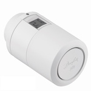

*To contribute to this page, edit the following
[file](https://github.com/Koenkk/zigbee2mqtt.io/blob/master/docs/devices/014G2461.md)*

# Danfoss 014G2461

| Model | 014G2461  |
| Vendor  | Danfoss  |
| Description | Ally thermostat |
| Exposes | battery, keypad_lockout, mounted_mode_active, mounted_mode_control, thermostat_vertical_orientation, viewing_direction, heat_available, heat_required, setpoint_change_source, climate (occupied_heating_setpoint, local_temperature, pi_heating_demand, system_mode, running_state), external_measured_room_sensor, window_open_internal, window_open_external, day_of_week, trigger_time, algorithm_scale_factor, load_estimate, linkquality |
| Picture |  |

## Notes


### Pairing
* Install the device on the valve. Insert the batteries (and M will display).
* Push the "o" button for 5 seconds to calibrate the valve motor.
* Push the "o" button for briefly to enter Pairing mode (can take upto 60 seconds).

To factory reset:
* Remove one battery.
* Press and hold "o" button.
* Insert battery and hold button pressed for about 3 seconds (display will flash all symbols).

### Device type specific configuration
*[How to use device type specific configuration](../information/configuration.md)*

* `legacy`: Set to `false` to disable the legacy integration (highly recommended!) (default: true)


## OTA updates
This device supports OTA updates, for more information see [OTA updates](../information/ota_updates.md).


## Exposes

### Battery (numeric)
Remaining battery in %.
Value can be found in the published state on the `battery` property.
It's not possible to read (`/get`) or write (`/set`) this value.
The minimal value is `0` and the maximum value is `100`.
The unit of this value is `%`.

### Keypad_lockout (binary)
Enables/disables physical input on the device.
Value can be found in the published state on the `keypad_lockout` property.
To read (`/get`) the value publish a message to topic `zigbee2mqtt/FRIENDLY_NAME/get` with payload `{"keypad_lockout": ""}`.
To write (`/set`) a value publish a message to topic `zigbee2mqtt/FRIENDLY_NAME/set` with payload `{"keypad_lockout": NEW_VALUE}`.
If value equals `lock1` keypad_lockout is ON, if `unlock` OFF.

### Mounted_mode_active (binary)
Is the unit in mounting mode. This is set to `false` for mounted (already on the radiator) or `true` for not mounted (after factory reset).
Value can be found in the published state on the `mounted_mode_active` property.
To read (`/get`) the value publish a message to topic `zigbee2mqtt/FRIENDLY_NAME/get` with payload `{"mounted_mode_active": ""}`.
It's not possible to write (`/set`) this value.
If value equals `true` mounted_mode_active is ON, if `false` OFF.

### Mounted_mode_control (binary)
Set the unit mounting mode. `false` Go to Mounted Mode or `true` Go to Mounting Mode.
Value can be found in the published state on the `mounted_mode_control` property.
To read (`/get`) the value publish a message to topic `zigbee2mqtt/FRIENDLY_NAME/get` with payload `{"mounted_mode_control": ""}`.
To write (`/set`) a value publish a message to topic `zigbee2mqtt/FRIENDLY_NAME/set` with payload `{"mounted_mode_control": NEW_VALUE}`.
If value equals `true` mounted_mode_control is ON, if `false` OFF.

### Thermostat_vertical_orientation (binary)
Thermostat Orientation. This is important for the PID in how it assesses temperature. `false` Horizontal or `true` Vertical.
Value can be found in the published state on the `thermostat_vertical_orientation` property.
To read (`/get`) the value publish a message to topic `zigbee2mqtt/FRIENDLY_NAME/get` with payload `{"thermostat_vertical_orientation": ""}`.
To write (`/set`) a value publish a message to topic `zigbee2mqtt/FRIENDLY_NAME/set` with payload `{"thermostat_vertical_orientation": NEW_VALUE}`.
If value equals `true` thermostat_vertical_orientation is ON, if `false` OFF.

### Viewing_direction (numeric)
Viewing/Display Direction. `0` Horizontal or `1` Vertical.
Value can be found in the published state on the `viewing_direction` property.
To read (`/get`) the value publish a message to topic `zigbee2mqtt/FRIENDLY_NAME/get` with payload `{"viewing_direction": ""}`.
To write (`/set`) a value publish a message to topic `zigbee2mqtt/FRIENDLY_NAME/set` with payload `{"viewing_direction": NEW_VALUE}`.
The minimal value is `0` and the maximum value is `1`.

### Heat_available (binary)
Not clear how this affects operation. `false` No Heat Available or `true` Heat Available.
Value can be found in the published state on the `heat_available` property.
To read (`/get`) the value publish a message to topic `zigbee2mqtt/FRIENDLY_NAME/get` with payload `{"heat_available": ""}`.
To write (`/set`) a value publish a message to topic `zigbee2mqtt/FRIENDLY_NAME/set` with payload `{"heat_available": NEW_VALUE}`.
If value equals `true` heat_available is ON, if `false` OFF.

### Heat_required (binary)
Whether or not the unit needs warm water. `false` No Heat Request or `true` Heat Request.
Value can be found in the published state on the `heat_required` property.
To read (`/get`) the value publish a message to topic `zigbee2mqtt/FRIENDLY_NAME/get` with payload `{"heat_required": ""}`.
It's not possible to write (`/set`) this value.
If value equals `true` heat_required is ON, if `false` OFF.

### Setpoint_change_source (binary)
Values observed are `0` (set locally) or `2` (set via Zigbee).
Value can be found in the published state on the `setpoint_change_source` property.
It's not possible to read (`/get`) or write (`/set`) this value.
If value equals `0` setpoint_change_source is ON, if `1` OFF.

### Climate 
This climate device supports the following features: `occupied_heating_setpoint`, `local_temperature`, `pi_heating_demand`, `system_mode`, `running_state`.
- `occupied_heating_setpoint`: Temperature setpoint. To control publish a message to topic `zigbee2mqtt/FRIENDLY_NAME/set` with payload `{"occupied_heating_setpoint": VALUE}` where `VALUE` is the °C between `5` and `32`. To read send a message to `zigbee2mqtt/FRIENDLY_NAME/get` with payload `{"occupied_heating_setpoint": ""}`.
- `local_temperature`: Current temperature measured on the device (in °C). To read send a message to `zigbee2mqtt/FRIENDLY_NAME/get` with payload `{"local_temperature": ""}`.
- `system_mode`: Mode of this device. To control publish a message to topic `zigbee2mqtt/FRIENDLY_NAME/set` with payload `{"system_mode": VALUE}` where `VALUE` is one of: `heat`. To read send a message to `zigbee2mqtt/FRIENDLY_NAME/get` with payload `{"system_mode": ""}`.
- `running_state`: The current running state. Possible values are: `idle`, `heat`. To read send a message to `zigbee2mqtt/FRIENDLY_NAME/get` with payload `{"running_state": ""}`.

### External_measured_room_sensor (numeric)
Set at maximum 3 hours interval but not more often than every 30 minutes at every 100 value change. Resets every 3hours to standard (-8000=undefined)..
Value can be found in the published state on the `external_measured_room_sensor` property.
To read (`/get`) the value publish a message to topic `zigbee2mqtt/FRIENDLY_NAME/get` with payload `{"external_measured_room_sensor": ""}`.
To write (`/set`) a value publish a message to topic `zigbee2mqtt/FRIENDLY_NAME/set` with payload `{"external_measured_room_sensor": NEW_VALUE}`.

### Window_open_internal (numeric)
0=Quarantine, 1=Windows are closed, 2=Hold - Windows are maybe about to open, 3=Open window detected, 4=In window open state from external but detected closed locally.
Value can be found in the published state on the `window_open_internal` property.
To read (`/get`) the value publish a message to topic `zigbee2mqtt/FRIENDLY_NAME/get` with payload `{"window_open_internal": ""}`.
It's not possible to write (`/set`) this value.
The minimal value is `0` and the maximum value is `4`.

### Window_open_external (binary)
Set if the window is open or close. This setting will trigger a change in the internal window and heating demand. `false` (windows are closed) or `true` (windows are open).
Value can be found in the published state on the `window_open_external` property.
To read (`/get`) the value publish a message to topic `zigbee2mqtt/FRIENDLY_NAME/get` with payload `{"window_open_external": ""}`.
To write (`/set`) a value publish a message to topic `zigbee2mqtt/FRIENDLY_NAME/set` with payload `{"window_open_external": NEW_VALUE}`.
If value equals `true` window_open_external is ON, if `false` OFF.

### Day_of_week (enum)
Exercise day of week: 0=Sun...6=Sat, 7=undefined.
Value can be found in the published state on the `day_of_week` property.
To read (`/get`) the value publish a message to topic `zigbee2mqtt/FRIENDLY_NAME/get` with payload `{"day_of_week": ""}`.
To write (`/set`) a value publish a message to topic `zigbee2mqtt/FRIENDLY_NAME/set` with payload `{"day_of_week": NEW_VALUE}`.
The possible values are: `sunday`, `monday`, `tuesday`, `wednesday`, `thursday`, `friday`, `saturday`, `away_or_vacation`.

### Trigger_time (numeric)
Exercise trigger time. Minutes since midnight (65535=undefined). Range 0 to 1439.
Value can be found in the published state on the `trigger_time` property.
To read (`/get`) the value publish a message to topic `zigbee2mqtt/FRIENDLY_NAME/get` with payload `{"trigger_time": ""}`.
To write (`/set`) a value publish a message to topic `zigbee2mqtt/FRIENDLY_NAME/set` with payload `{"trigger_time": NEW_VALUE}`.
The minimal value is `0` and the maximum value is `65535`.

### Algorithm_scale_factor (numeric)
Scale factor of setpoint filter timeconstant ("aggressiveness" of control algorithm) 1= Quick ...  5=Moderate ... 10=Slow.
Value can be found in the published state on the `algorithm_scale_factor` property.
To read (`/get`) the value publish a message to topic `zigbee2mqtt/FRIENDLY_NAME/get` with payload `{"algorithm_scale_factor": ""}`.
To write (`/set`) a value publish a message to topic `zigbee2mqtt/FRIENDLY_NAME/set` with payload `{"algorithm_scale_factor": NEW_VALUE}`.
The minimal value is `1` and the maximum value is `10`.

### Load_estimate (numeric)
Load estimate on this radiator.
Value can be found in the published state on the `load_estimate` property.
To read (`/get`) the value publish a message to topic `zigbee2mqtt/FRIENDLY_NAME/get` with payload `{"load_estimate": ""}`.
It's not possible to write (`/set`) this value.

### Linkquality (numeric)
Link quality (signal strength).
Value can be found in the published state on the `linkquality` property.
It's not possible to read (`/get`) or write (`/set`) this value.
The minimal value is `0` and the maximum value is `255`.
The unit of this value is `lqi`.

## Manual Home Assistant configuration
Although Home Assistant integration through [MQTT discovery](../integration/home_assistant) is preferred,
manual integration is possible with the following configuration:



```yaml
sensor:
  - platform: "mqtt"
    state_topic: "zigbee2mqtt/<FRIENDLY_NAME>"
    availability_topic: "zigbee2mqtt/bridge/state"
    value_template: "{{ value_json.battery }}"
    unit_of_measurement: "%"
    device_class: "battery"
    state_class: "measurement"

switch:
  - platform: "mqtt"
    state_topic: "zigbee2mqtt/<FRIENDLY_NAME>"
    availability_topic: "zigbee2mqtt/bridge/state"
    value_template: "{{ value_json.keypad_lockout }}"
    payload_on: "lock1"
    payload_off: "unlock"
    command_topic: "zigbee2mqtt/<FRIENDLY_NAME>/set"
    command_topic_postfix: "keypad_lockout"

binary_sensor:
  - platform: "mqtt"
    state_topic: "zigbee2mqtt/<FRIENDLY_NAME>"
    availability_topic: "zigbee2mqtt/bridge/state"
    value_template: "{{ value_json.mounted_mode_active }}"
    payload_on: true
    payload_off: false

switch:
  - platform: "mqtt"
    state_topic: "zigbee2mqtt/<FRIENDLY_NAME>"
    availability_topic: "zigbee2mqtt/bridge/state"
    value_template: " true  false "
    payload_on: "true"
    payload_off: "false"
    command_topic: "zigbee2mqtt/<FRIENDLY_NAME>/set"
    command_topic_postfix: "mounted_mode_control"

switch:
  - platform: "mqtt"
    state_topic: "zigbee2mqtt/<FRIENDLY_NAME>"
    availability_topic: "zigbee2mqtt/bridge/state"
    value_template: " true  false "
    payload_on: "true"
    payload_off: "false"
    command_topic: "zigbee2mqtt/<FRIENDLY_NAME>/set"
    command_topic_postfix: "thermostat_vertical_orientation"

sensor:
  - platform: "mqtt"
    state_topic: "zigbee2mqtt/<FRIENDLY_NAME>"
    availability_topic: "zigbee2mqtt/bridge/state"
    value_template: "{{ value_json.viewing_direction }}"

switch:
  - platform: "mqtt"
    state_topic: "zigbee2mqtt/<FRIENDLY_NAME>"
    availability_topic: "zigbee2mqtt/bridge/state"
    value_template: " true  false "
    payload_on: "true"
    payload_off: "false"
    command_topic: "zigbee2mqtt/<FRIENDLY_NAME>/set"
    command_topic_postfix: "heat_available"

binary_sensor:
  - platform: "mqtt"
    state_topic: "zigbee2mqtt/<FRIENDLY_NAME>"
    availability_topic: "zigbee2mqtt/bridge/state"
    value_template: "{{ value_json.heat_required }}"
    payload_on: true
    payload_off: false

binary_sensor:
  - platform: "mqtt"
    state_topic: "zigbee2mqtt/<FRIENDLY_NAME>"
    availability_topic: "zigbee2mqtt/bridge/state"
    value_template: "{{ value_json.setpoint_change_source }}"
    payload_on: 0
    payload_off: 1

climate:
  - platform: "mqtt"
    availability_topic: "zigbee2mqtt/bridge/state"
    temperature_unit: "C"
    temp_step: 0.5
    min_temp: "5"
    max_temp: "32"
    current_temperature_topic: true
    current_temperature_template: "{{ value_json.local_temperature }}"
    mode_state_topic: true
    mode_state_template: "{{ value_json.system_mode }}"
    modes: 
      - "heat"
    mode_command_topic: true
    action_topic: true
    action_template: "{{ values[value_json.running_state] }}"
    temperature_command_topic: "occupied_heating_setpoint"
    temperature_state_template: "{{ value_json.occupied_heating_setpoint }}"
    temperature_state_topic: true

sensor:
  - platform: "mqtt"
    state_topic: "zigbee2mqtt/<FRIENDLY_NAME>"
    availability_topic: "zigbee2mqtt/bridge/state"
    value_template: "{{ value_json.external_measured_room_sensor }}"

sensor:
  - platform: "mqtt"
    state_topic: "zigbee2mqtt/<FRIENDLY_NAME>"
    availability_topic: "zigbee2mqtt/bridge/state"
    value_template: "{{ value_json.window_open_internal }}"

switch:
  - platform: "mqtt"
    state_topic: "zigbee2mqtt/<FRIENDLY_NAME>"
    availability_topic: "zigbee2mqtt/bridge/state"
    value_template: " true  false "
    payload_on: "true"
    payload_off: "false"
    command_topic: "zigbee2mqtt/<FRIENDLY_NAME>/set"
    command_topic_postfix: "window_open_external"

sensor:
  - platform: "mqtt"
    state_topic: "zigbee2mqtt/<FRIENDLY_NAME>"
    availability_topic: "zigbee2mqtt/bridge/state"
    value_template: "{{ value_json.day_of_week }}"
    enabled_by_default: false

select:
  - platform: "mqtt"
    state_topic: true
    availability_topic: "zigbee2mqtt/bridge/state"
    value_template: "{{ value_json.day_of_week }}"
    command_topic: "zigbee2mqtt/<FRIENDLY_NAME>/set"
    command_topic_postfix: "day_of_week"
    options: 
      - "sunday"
      - "monday"
      - "tuesday"
      - "wednesday"
      - "thursday"
      - "friday"
      - "saturday"
      - "away_or_vacation"

sensor:
  - platform: "mqtt"
    state_topic: "zigbee2mqtt/<FRIENDLY_NAME>"
    availability_topic: "zigbee2mqtt/bridge/state"
    value_template: "{{ value_json.trigger_time }}"

sensor:
  - platform: "mqtt"
    state_topic: "zigbee2mqtt/<FRIENDLY_NAME>"
    availability_topic: "zigbee2mqtt/bridge/state"
    value_template: "{{ value_json.algorithm_scale_factor }}"

sensor:
  - platform: "mqtt"
    state_topic: "zigbee2mqtt/<FRIENDLY_NAME>"
    availability_topic: "zigbee2mqtt/bridge/state"
    value_template: "{{ value_json.load_estimate }}"

sensor:
  - platform: "mqtt"
    state_topic: "zigbee2mqtt/<FRIENDLY_NAME>"
    availability_topic: "zigbee2mqtt/bridge/state"
    value_template: "{{ value_json.linkquality }}"
    unit_of_measurement: "lqi"
    enabled_by_default: false
    icon: "mdi:signal"
    state_class: "measurement"

sensor:
  - platform: "mqtt"
    state_topic: "zigbee2mqtt/<FRIENDLY_NAME>"
    availability_topic: "zigbee2mqtt/bridge/state"
    icon: "mdi:update"
    value_template: "{{ value_json['update']['state'] }}"
    enabled_by_default: false

binary_sensor:
  - platform: "mqtt"
    state_topic: "zigbee2mqtt/<FRIENDLY_NAME>"
    availability_topic: "zigbee2mqtt/bridge/state"
    payload_on: true
    payload_off: false
    value_template: "{{ value_json.update_available}}"
    enabled_by_default: false
```



