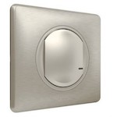

*To contribute to this page, edit the following
[file](https://github.com/Koenkk/zigbee2mqtt.io/blob/master/docs/devices/067771.md)*

# Legrand 067771

| Model | 067771  |
| Vendor  | Legrand  |
| Description | Wired switch without neutral |
| Supports | on/off |
| Picture |  |

## Notes

### Model numbers
Model number depends on the country and the colour of the devices, for instance:

- French models are branded as Céliane with Netatmo, and models for this device depends on the colour, with the following numbers: "0 677 21", "0 677 71" and "0 648 91".

- Spanish models are branded as Legrand Valena Next, and models for this device depends on the colour, with the following numbers: "7 418 10", "7 418 40" and "7 418 70".

Other brand names depending on the country:
- Availability for Céliane™ with Netatmo &#8594;	 France and Overseas territories, Greece, Poland, Hungary, Tunisia, Morocco, Ivory Coast, Czech Republic, Russia, Mauritius
- Availability for Dooxie™ with Netatmo &#8594;	 France and Overseas territories
- Availability for Mosaic™ with Netatmo &#8594;	 France and Overseas territories, Ivory Coast
- Availability for Living Now™ with Netatmo &#8594;	 Italy, Belgium, Greece, Portugal, Lebanon, Israel, Chile, Peru, Mexico
- Availability for Valena Allure™ with Netatmo &#8594;	 Greece, Germany, Austria, Poland, Slovakia, Bulgaria, Czech Republic, Hungary, Russia
- Availability for Valena Life™ with Netatmo &#8594;	Greece, Germany, Austria, Portugal, Poland, Slovakia, Bulgaria, Czech Republic, Hungary, Lituania, Russia
- Availability for Valena Next™ with Netatmo &#8594;	Spain, Belgium
- Availability for Arteor™ with Netatmo &#8594;	Australia, New Zealand, India, Malaysia, Lebanon, Mauritius, South Africa
- Availability for Plexo™ with Netatmo &#8594;	France and Overseas territories, Spain, Belgium
- Availability for Modul'Up™ with Netatmo &#8594;	France and Overseas territories

### LED configuration
* `permanent_led`: enable or disable the permanent blue LED. Values: `ON` / `OFF` (default)
* `led_when_on`: enables the LED when the light is on. Values: `ON` / `OFF` (default)

Example of MQTT message payload to disable permanent LED and enable LED when the lights are on. This shouuld be sent to `zigbee2mqtt/[FRIENDLY_NAME]/set`:

```js
{
  "permanent_led": "OFF",
  "led_when_on": "ON"
}
```

### Dimmer
* `dimmer_enabled`: enable or disable the dimming functions. Values: `ON` / `OFF` (default)

Example of MQTT message payload to enable dimming. This shouuld be sent to `zigbee2mqtt/[FRIENDLY_NAME]/set`:

```
{
  "dimmer_enabled": "ON"
}
```

### Identify
Helps to identify the switch using the LED.

* `identify['effect']`:  only works for blink3 & fixed in `effect`. Values: 
  - `blink3`
  - `fixed`
  - `blinkgreen`
  - `blinkblue` 

* `identify['color']`:  only works for blink3 & fixed in `effect`. Values: 
  - `default`
  - `red`
  - `green`
  - `blue`
  - `lightblue`
  - `yellow`
  - `pink`
  - `white`

Example of MQTT message payload to Identify the switch. This shouuld be sent to `zigbee2mqtt/[FRIENDLY_NAME]/set`:

```js
{
  "identify": {
    "effect": "blink3",
    "color": "white"
  }
}
```


## Manual Home Assistant configuration
Although Home Assistant integration through [MQTT discovery](../integration/home_assistant) is preferred,
manual integration is possible with the following configuration:



```yaml
switch:
  - platform: "mqtt"
    state_topic: "zigbee2mqtt/<FRIENDLY_NAME>"
    availability_topic: "zigbee2mqtt/bridge/state"
    payload_off: "OFF"
    payload_on: "ON"
    value_template: "{{ value_json.state }}"
    command_topic: "zigbee2mqtt/<FRIENDLY_NAME>/set"

sensor:
  - platform: "mqtt"
    state_topic: "zigbee2mqtt/<FRIENDLY_NAME>"
    availability_topic: "zigbee2mqtt/bridge/state"
    icon: "mdi:signal"
    unit_of_measurement: "lqi"
    value_template: "{{ value_json.linkquality }}"
```



