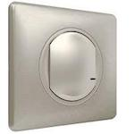

*To contribute to this page, edit the following
[file](https://github.com/Koenkk/zigbee2mqtt.io/blob/master/docs/devices/067773.md)*

# Legrand 067773

| Model | 067773  |
| Vendor  | Legrand  |
| Description | Wireless remote switch |
| Supports | action |
| Picture |  |

## Notes


### Legacy integration
By default (for backwards compatibility purposes) the legacy integration is enabled.
For new users it is recommended to **disable** this as it has several fundamental problems.
To disable the legacy integration add the following to your `configuration.yaml`:


```yaml
'0xabc457fffe679xyz':
    friendly_name: my_remote
    legacy: false
```


### Device type specific configuration
*[How to use device type specific configuration](../information/configuration.md)*

* `legacy`: Set to `true` to disable the legacy integration (highly recommended!)


### Model numbers
Model number depends on the country and the colour of the devices.
French models are branded as Céliane with Netatmo, and models for this device depends on the colour, with the following numbers: "0 677 23", "0 677 73", and "0 648 93".
Spanish models are branded as Legrand Valena Next, and models for this device depends on the colour, with the following numbers: "7 418 13", "7 418 43" and "7 418 73".

### Binding
The remote supports [binding](../information/binding).


## Manual Home Assistant configuration
Although Home Assistant integration through [MQTT discovery](../integration/home_assistant) is preferred,
manual integration is possible with the following configuration:



```yaml
sensor:
  - platform: "mqtt"
    state_topic: "zigbee2mqtt/<FRIENDLY_NAME>"
    availability_topic: "zigbee2mqtt/bridge/state"
    icon: "mdi:gesture-double-tap"
    value_template: "{{ value_json.action }}"

sensor:
  - platform: "mqtt"
    state_topic: "zigbee2mqtt/<FRIENDLY_NAME>"
    availability_topic: "zigbee2mqtt/bridge/state"
    unit_of_measurement: "%"
    device_class: "battery"
    value_template: "{{ value_json.battery }}"

sensor:
  - platform: "mqtt"
    state_topic: "zigbee2mqtt/<FRIENDLY_NAME>"
    availability_topic: "zigbee2mqtt/bridge/state"
    icon: "mdi:signal"
    unit_of_measurement: "lqi"
    value_template: "{{ value_json.linkquality }}"
```



