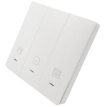

*To contribute to this page, edit the following
[file](https://github.com/Koenkk/zigbee2mqtt.io/blob/master/docs/devices/11830304.md)*

# Lonsonho 11830304

| Model | 11830304  |
| Vendor  | Lonsonho  |
| Description | Curtain switch |
| Exposes | cover (state, position), moving, calibration, motor_reversal, backlight_mode, calibration_time, linkquality |
| Picture |  |

## Notes

### Device type specific configuration
*[How to use device type specific configuration](../information/configuration.md)*

* `invert_cover`: By default the position/tilt values mean: open = 100, closed = 0. This can be inverted by setting this option to true (so open = 0, close = 100).


## Exposes

### Cover 
The current state of this cover is in the published state under the `state` property (value is `OPEN` or `CLOSE`).
To control this cover publish a message to topic `zigbee2mqtt/FRIENDLY_NAME/set` with payload `{"state": "OPEN"}`, `{"state": "CLOSE"}`, `{"state": "STOP"}`.
It's not possible to read (`/get`) this value.
To change the position publish a message to topic `zigbee2mqtt/FRIENDLY_NAME/set` with payload `{"position": VALUE}` where `VALUE` is a number between `0` and `100`.

### Moving (enum)
Value can be found in the published state on the `moving` property.
It's not possible to read (`/get`) or write (`/set`) this value.
The possible values are: `UP`, `STOP`, `DOWN`.

### Calibration (binary)
Value can be found in the published state on the `calibration` property.
To read (`/get`) the value publish a message to topic `zigbee2mqtt/FRIENDLY_NAME/get` with payload `{"calibration": ""}`.
To write (`/set`) a value publish a message to topic `zigbee2mqtt/FRIENDLY_NAME/set` with payload `{"calibration": NEW_VALUE}`.
If value equals `ON` calibration is ON, if `OFF` OFF.

### Motor_reversal (binary)
Value can be found in the published state on the `motor_reversal` property.
To read (`/get`) the value publish a message to topic `zigbee2mqtt/FRIENDLY_NAME/get` with payload `{"motor_reversal": ""}`.
To write (`/set`) a value publish a message to topic `zigbee2mqtt/FRIENDLY_NAME/set` with payload `{"motor_reversal": NEW_VALUE}`.
If value equals `ON` motor_reversal is ON, if `OFF` OFF.

### Backlight_mode (enum)
Value can be found in the published state on the `backlight_mode` property.
To read (`/get`) the value publish a message to topic `zigbee2mqtt/FRIENDLY_NAME/get` with payload `{"backlight_mode": ""}`.
To write (`/set`) a value publish a message to topic `zigbee2mqtt/FRIENDLY_NAME/set` with payload `{"backlight_mode": NEW_VALUE}`.
The possible values are: `LOW`, `MEDIUM`, `HIGH`.

### Calibration_time (numeric)
Calibration time.
Value can be found in the published state on the `calibration_time` property.
It's not possible to read (`/get`) or write (`/set`) this value.
The unit of this value is `S`.

### Linkquality (numeric)
Link quality (signal strength).
Value can be found in the published state on the `linkquality` property.
It's not possible to read (`/get`) or write (`/set`) this value.
The minimal value is `0` and the maximum value is `255`.
The unit of this value is `lqi`.

## Manual Home Assistant configuration
Although Home Assistant integration through [MQTT discovery](../integration/home_assistant) is preferred,
manual integration is possible with the following configuration:



```yaml
cover:
  - platform: "mqtt"
    availability_topic: "zigbee2mqtt/bridge/state"
    command_topic: "zigbee2mqtt/<FRIENDLY_NAME>/set"
    position_template: "{{ value_json.position }}"
    set_position_template: "{ \"position\": {{ position }} }"
    set_position_topic: "zigbee2mqtt/<FRIENDLY_NAME>/set"
    position_topic: "zigbee2mqtt/<FRIENDLY_NAME>"

sensor:
  - platform: "mqtt"
    state_topic: "zigbee2mqtt/<FRIENDLY_NAME>"
    availability_topic: "zigbee2mqtt/bridge/state"
    value_template: "{{ value_json.moving }}"
    enabled_by_default: true

switch:
  - platform: "mqtt"
    state_topic: "zigbee2mqtt/<FRIENDLY_NAME>"
    availability_topic: "zigbee2mqtt/bridge/state"
    value_template: "{{ value_json.calibration }}"
    payload_on: "ON"
    payload_off: "OFF"
    command_topic: "zigbee2mqtt/<FRIENDLY_NAME>/set"
    command_topic_postfix: "calibration"

switch:
  - platform: "mqtt"
    state_topic: "zigbee2mqtt/<FRIENDLY_NAME>"
    availability_topic: "zigbee2mqtt/bridge/state"
    value_template: "{{ value_json.motor_reversal }}"
    payload_on: "ON"
    payload_off: "OFF"
    command_topic: "zigbee2mqtt/<FRIENDLY_NAME>/set"
    command_topic_postfix: "motor_reversal"

sensor:
  - platform: "mqtt"
    state_topic: "zigbee2mqtt/<FRIENDLY_NAME>"
    availability_topic: "zigbee2mqtt/bridge/state"
    value_template: "{{ value_json.backlight_mode }}"
    enabled_by_default: false
    icon: "mdi:lightbulb"

select:
  - platform: "mqtt"
    state_topic: true
    availability_topic: "zigbee2mqtt/bridge/state"
    value_template: "{{ value_json.backlight_mode }}"
    command_topic: "zigbee2mqtt/<FRIENDLY_NAME>/set"
    command_topic_postfix: "backlight_mode"
    options: 
      - "LOW"
      - "MEDIUM"
      - "HIGH"
    enabled_by_default: false
    icon: "mdi:lightbulb"

sensor:
  - platform: "mqtt"
    state_topic: "zigbee2mqtt/<FRIENDLY_NAME>"
    availability_topic: "zigbee2mqtt/bridge/state"
    value_template: "{{ value_json.calibration_time }}"
    unit_of_measurement: "S"

sensor:
  - platform: "mqtt"
    state_topic: "zigbee2mqtt/<FRIENDLY_NAME>"
    availability_topic: "zigbee2mqtt/bridge/state"
    value_template: "{{ value_json.linkquality }}"
    unit_of_measurement: "lqi"
    enabled_by_default: false
    icon: "mdi:signal"
    state_class: "measurement"
```



