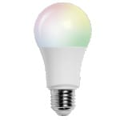

<!-- !!!! -->
<!-- You can only edit the "Notes"-Section between the two comment lines "Notes BEGIN" and "Notes END". -->
<!-- Do not use h1 or h2 heading within "## Notes"-Section. -->
<!-- !!!! -->

# Müller Licht 404001

|     |     |
|-----|-----|
| Model | 13577  |
| Vendor  | Bega |
| Description | LED bulb E27 805 lumen, dimmable, coolor changeable |
| Exposes | light (state, brightness,color_temp,color_temp_startup,color_xy), effect, linkquality |
| Picture |  |

<!-- Notes BEGIN: You can edit here. Add "## Notes" headline if not already present. -->
## Notes

### Pairing
Turn on and off 6 times within an interval between 0.5 and 2 seconds
<!-- Notes END: Do not edit below this line -->

