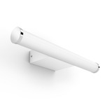

*To contribute to this page, edit the following
[file](https://github.com/Koenkk/zigbee2mqtt.io/blob/master/docs/devices/3402831P7.md)*

# Philips 3402831P7

| Model | 3402831P7  |
| Vendor  | Philips  |
| Description | Hue white ambiance bathroom mirror light Adore |
| Exposes | light (state, brightness, color_temp, color_temp_startup), effect, linkquality |
| Picture |  |

## Notes


### Pairing
Factory resetting a Hue bulb can be accomplished in 5 ways.
After resetting the bulb will automatically connect.

#### Touchlink factory reset
See [Touchlink](../information/touchlink)

#### Hue bridge
When the bulb is still connected to the Hue bridge, you can simply factory reset the bulb
by removing it from the bridge via the Hue app. Orphaned bulbs (configured to connect to a non-existing Zigbee network) can be adopted by a Hue bridge by entering the 6 character serial number in the Philips Hue app.

#### Hue dimmer switch
With [one](324131092621) of the [two](929002398602) Hue Dimmer switches it is possible to put the bulbs into a factory reset.

1. Power-supply the bulb
2. Bring the dimmer switch next to the bulb, as close as possible
3. Hold the I/On and 0/Off button pressed simultaneously for 10 to 12 seconds until…
4. The bulb flashes a couple of times. Don't release the buttons until the last flash + a safety second
5. Switch the bulb off and on again: it can now be paired again.

See also the [VIDEO: Factory reset a Hue bulb with Hue dimmer switch](https://www.youtube.com/watch?v=qvlEAELiJKs).

#### Bluetooth (if supported by device)
Install the Philips Hue Bluetooth app for [Android](https://play.google.com/store/apps/details?id=com.signify.hue.blue)
or [iOS](https://apps.apple.com/us/app/philips-hue-bluetooth/id1456604186). You can use the app to trigger a factory reset on a paired light. (Note: The light will only be in bluetooth pairing
mode for a couple of minutes after power-on)

#### TRADFRI remote control
This may also be possible with the
[Tradfri Remote Control](https://www.ikea.com/us/en/images/products/tradfri-remote-control__0489469_PE623665_S4.JPG)
by pressing and holding the reset button on the bottom of the remote (next to the battery).
[This may not always work, even if the Hue bulb starts flashing](https://github.com/Koenkk/zigbee2mqtt/issues/296#issuecomment-416923751).


### Power-on behavior
This device allows you to set the power-on behavior. Note that this requires at least November/December '18 firmware update of the device.
Send a MQTT command to [`zigbee2mqtt/FRIENDLY_NAME/set`](https://www.zigbee2mqtt.io/information/mqtt_topics_and_message_structure.html#zigbee2mqttfriendly_nameset) with the following payload.

```js
{
    "hue_power_on_behavior": "on",          // default, on, off, recover
    "hue_power_on_brightness": 125,         // same values as brightness
    "hue_power_on_color_temperature": 280,  // same values as color_temp
    "hue_power_on_color": "#0000FF",        // color in hex notation, e.g. #0000FF = blue

}
```

Attribute Value | Description
----------------|-----------------------------------------------
default         | reset to factory default value
on              | bulb on after power loss with configured brightness, color-temperature and color
off             | bulb off after power loss
recover         | last running state after power loss

Rules:
- `hue_power_on_behavior` value always has to be provided
- `hue_power_on_brightness`, `hue_power_on_color_temperature` and `hue_power_on_color` can only be provided when `hue_power_on_behavior` = `on`
- `hue_power_on_color_temperature` and `hue_power_on_color` cannot be provided together, only one can be set
- When setting `hue_power_on_behavior` = `on`, any not provided values will be reset to their factory defaults

Note: if `hue_power_on_behavior` is set to `off`, then the only way to turn the bulb on will be through a paired smart device (see pairing above). You will NOT be able to turn the bulb on by sequentially switching power on and off.

### Device type specific configuration
*[How to use device type specific configuration](../information/configuration.md)*

* `color_sync`: Synchronizes the color values in the state, e.g. if the state contains `color_temp` and `color.xy` and
the `color_temp` is set, `color.xy` will be updated to match the `color_temp`. (default: `true`)


* `transition`: Controls the transition time (in seconds) of on/off, brightness,
color temperature (if applicable) and color (if applicable) changes. Defaults to `0` (no transition).
Note that this value is overridden if a `transition` value is present in the MQTT command payload.


## OTA updates
This device supports OTA updates, for more information see [OTA updates](../information/ota_updates.md).


## Exposes

### Light 
This light supports the following features: `state`, `brightness`, `color_temp`, `color_temp_startup`.
- `state`: To control the state publish a message to topic `zigbee2mqtt/FRIENDLY_NAME/set` with payload `{"state": "ON"}`, `{"state": "OFF"}` or `{"state": "TOGGLE"}`. To read the state send a message to `zigbee2mqtt/FRIENDLY_NAME/get` with payload `{"state": ""}`.
- `brightness`: To control the brightness publish a message to topic `zigbee2mqtt/FRIENDLY_NAME/set` with payload `{"brightness": VALUE}` where `VALUE` is a number between `0` and `254`. To read the brightness send a message to `zigbee2mqtt/FRIENDLY_NAME/get` with payload `{"brightness": ""}`.
- `color_temp`: To control the color temperature (in reciprocal megakelvin a.k.a. mired scale) publish a message to topic `zigbee2mqtt/FRIENDLY_NAME/set` with payload `{"color_temp": VALUE}` where `VALUE` is a number between `150` and `500`, the higher the warmer the color. To read the color temperature send a message to `zigbee2mqtt/FRIENDLY_NAME/get` with payload `{"color_temp": ""}`. Besides the numeric values the following values are accepected: `coolest`, `cool`, `neutral`, `warm`, `warmest`.
- `color_temp_startup`: To set the startup color temperature (in reciprocal megakelvin a.k.a. mired scale) publish a message to topic `zigbee2mqtt/FRIENDLY_NAME/set` with payload `{"color_temp_startup": VALUE}` where `VALUE` is a number between `150` and `500`, the higher the warmer the color. To read the startup color temperature send a message to `zigbee2mqtt/FRIENDLY_NAME/get` with payload `{"color_temp_startup": ""}`. Besides the numeric values the following values are accepected: `coolest`, `cool`, `neutral`, `warm`, `warmest`, `previous`.

#### Transition
For all of the above mentioned features it is possible to do a transition of the value over time. To do this add an additional property `transition` to the payload which is the transition time in seconds.
Examples: `{"brightness":156,"transition":3}`, `{"color_temp":241,"transition":1}`.

#### Moving/stepping
Instead of setting a value (e.g. brightness) directly it is also possible to:
- move: this will automatically move the value over time, to stop send value `stop` or `0`.
- step: this will increment/decrement the current value by the given one.

The direction of move and step can be either up or down, provide a negative value to move/step down, a positive value to move/step up.
To do this send a payload like below to `zigbee2mqtt/FRIENDLY_NAME/set`

**NOTE**: brightness move/step will stop at the minimum brightness and won't turn on the light when it's off. In this case use `brightness_move_onoff`/`brightness_step_onoff`
````js
{
  "brightness_move": -40, // Starts moving brightness down at 40 units per second
  "brightness_move": 0, // Stop moving brightness
  "brightness_step": 40 // Increases brightness by 40
  "color_temp_move": 60, // Starts moving color temperature up at 60 units per second
  "color_temp_move": "stop", // Stop moving color temperature
  "color_temp_step": 99, // Increase color temperature by 99
}
````

### Effect (enum)
Triggers an effect on the light (e.g. make light blink for a few seconds).
Value will **not** be published in the state.
It's not possible to read (`/get`) this value.
To write (`/set`) a value publish a message to topic `zigbee2mqtt/FRIENDLY_NAME/set` with payload `{"effect": NEW_VALUE}`.
The possible values are: `blink`, `breathe`, `okay`, `channel_change`, `finish_effect`, `stop_effect`.

### Linkquality (numeric)
Link quality (signal strength).
Value can be found in the published state on the `linkquality` property.
It's not possible to read (`/get`) or write (`/set`) this value.
The minimal value is `0` and the maximum value is `255`.
The unit of this value is `lqi`.

## Manual Home Assistant configuration
Although Home Assistant integration through [MQTT discovery](../integration/home_assistant) is preferred,
manual integration is possible with the following configuration:



```yaml
light:
  - platform: "mqtt"
    state_topic: "zigbee2mqtt/<FRIENDLY_NAME>"
    availability_topic: "zigbee2mqtt/bridge/state"
    brightness: true
    schema: "json"
    command_topic: "zigbee2mqtt/<FRIENDLY_NAME>/set"
    brightness_scale: 254
    color_mode: true
    supported_color_modes: 
      - "color_temp"
    max_mireds: 500
    min_mireds: 150
    effect: true
    effect_list: 
      - "blink"
      - "breathe"
      - "okay"
      - "channel_change"
      - "finish_effect"
      - "stop_effect"

sensor:
  - platform: "mqtt"
    state_topic: "zigbee2mqtt/<FRIENDLY_NAME>"
    availability_topic: "zigbee2mqtt/bridge/state"
    value_template: "{{ value_json.linkquality }}"
    unit_of_measurement: "lqi"
    enabled_by_default: false
    icon: "mdi:signal"
    state_class: "measurement"

sensor:
  - platform: "mqtt"
    state_topic: "zigbee2mqtt/<FRIENDLY_NAME>"
    availability_topic: "zigbee2mqtt/bridge/state"
    icon: "mdi:update"
    value_template: "{{ value_json['update']['state'] }}"
    enabled_by_default: false

binary_sensor:
  - platform: "mqtt"
    state_topic: "zigbee2mqtt/<FRIENDLY_NAME>"
    availability_topic: "zigbee2mqtt/bridge/state"
    payload_on: true
    payload_off: false
    value_template: "{{ value_json.update_available}}"
    enabled_by_default: false
```



