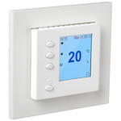

*To contribute to this page, edit the following
[file](https://github.com/Koenkk/zigbee2mqtt.io/blob/master/docs/devices/4523430.md)*

# ELKO 4523430

| Model | 4523430  |
| Vendor  | ELKO  |
| Description | ESH Plus Super TR RF PH |
| Exposes | display_text, climate (occupied_heating_setpoint, local_temperature, system_mode, running_state, local_temperature_calibration), sensor_mode, floor_temp, max_floor_temp, mean_power, child_lock, frost_guard, linkquality |
| Picture |  |

## Notes

### Pairing
* Press "arrow up" and "M" simultaneously until "joining" and "pairing" is shown on the ELKO Super TR RF display.

## Exposes

### Display_text (text)
Displayed text on thermostat display (zone). Max 14 characters.
Value can be found in the published state on the `display_text` property.
To read (`/get`) the value publish a message to topic `zigbee2mqtt/FRIENDLY_NAME/get` with payload `{"display_text": ""}`.
To write (`/set`) a value publish a message to topic `zigbee2mqtt/FRIENDLY_NAME/set` with payload `{"display_text": NEW_VALUE}`.

### Climate 
This climate device supports the following features: `occupied_heating_setpoint`, `local_temperature`, `system_mode`, `running_state`, `local_temperature_calibration`.
- `occupied_heating_setpoint`: Temperature setpoint. To control publish a message to topic `zigbee2mqtt/FRIENDLY_NAME/set` with payload `{"occupied_heating_setpoint": VALUE}` where `VALUE` is the °C between `5` and `50`. To read send a message to `zigbee2mqtt/FRIENDLY_NAME/get` with payload `{"occupied_heating_setpoint": ""}`.
- `local_temperature`: Current temperature measured on the device (in °C). Reading (`/get`) this attribute is not possible.
- `system_mode`: Mode of this device. To control publish a message to topic `zigbee2mqtt/FRIENDLY_NAME/set` with payload `{"system_mode": VALUE}` where `VALUE` is one of: `off`, `heat`. To read send a message to `zigbee2mqtt/FRIENDLY_NAME/get` with payload `{"system_mode": ""}`.
- `running_state`: The current running state. Possible values are: `idle`, `heat`. To read send a message to `zigbee2mqtt/FRIENDLY_NAME/get` with payload `{"running_state": ""}`.

### Sensor_mode (enum)
"air" = Thermostat uses air sensor."floor" = Thermostat uses floor sensor. "supervisor_floor" = Thermostat uses air sensor and with max temperatur from "max_floor_temp".
Value can be found in the published state on the `sensor_mode` property.
To read (`/get`) the value publish a message to topic `zigbee2mqtt/FRIENDLY_NAME/get` with payload `{"sensor_mode": ""}`.
To write (`/set`) a value publish a message to topic `zigbee2mqtt/FRIENDLY_NAME/set` with payload `{"sensor_mode": NEW_VALUE}`.
The possible values are: `air`, `floor`, `supervisor_floor`.

### Floor_temp (numeric)
Current temperature measured from the floor sensor.
Value can be found in the published state on the `floor_temp` property.
To read (`/get`) the value publish a message to topic `zigbee2mqtt/FRIENDLY_NAME/get` with payload `{"floor_temp": ""}`.
It's not possible to write (`/set`) this value.
The unit of this value is `°C`.

### Max_floor_temp (numeric)
Set max floor temperature (between 20-35 °C) when "supervisor_floor" is set.
Value can be found in the published state on the `max_floor_temp` property.
To read (`/get`) the value publish a message to topic `zigbee2mqtt/FRIENDLY_NAME/get` with payload `{"max_floor_temp": ""}`.
To write (`/set`) a value publish a message to topic `zigbee2mqtt/FRIENDLY_NAME/set` with payload `{"max_floor_temp": NEW_VALUE}`.
The minimal value is `20` and the maximum value is `35`.
The unit of this value is `°C`.

### Mean_power (numeric)
Reports average power usage last 10 minutes.
Value can be found in the published state on the `mean_power` property.
To read (`/get`) the value publish a message to topic `zigbee2mqtt/FRIENDLY_NAME/get` with payload `{"mean_power": ""}`.
It's not possible to write (`/set`) this value.
The unit of this value is `W`.

### Child_lock (binary)
Enables/disables physical input on the device.
Value can be found in the published state on the `child_lock` property.
To read (`/get`) the value publish a message to topic `zigbee2mqtt/FRIENDLY_NAME/get` with payload `{"child_lock": ""}`.
To write (`/set`) a value publish a message to topic `zigbee2mqtt/FRIENDLY_NAME/set` with payload `{"child_lock": NEW_VALUE}`.
If value equals `lock` child_lock is ON, if `unlock` OFF.

### Frost_guard (binary)
When frost guard is ON, it is activated when the thermostat is switched OFF with the ON/OFF button.At the same time, the display will fade and the text "Frostsikring x °C" appears in the display and remains until the thermostat is switched on again..
Value can be found in the published state on the `frost_guard` property.
To read (`/get`) the value publish a message to topic `zigbee2mqtt/FRIENDLY_NAME/get` with payload `{"frost_guard": ""}`.
To write (`/set`) a value publish a message to topic `zigbee2mqtt/FRIENDLY_NAME/set` with payload `{"frost_guard": NEW_VALUE}`.
If value equals `on` frost_guard is ON, if `off` OFF.

### Linkquality (numeric)
Link quality (signal strength).
Value can be found in the published state on the `linkquality` property.
It's not possible to read (`/get`) or write (`/set`) this value.
The minimal value is `0` and the maximum value is `255`.
The unit of this value is `lqi`.

## Manual Home Assistant configuration
Although Home Assistant integration through [MQTT discovery](../integration/home_assistant) is preferred,
manual integration is possible with the following configuration:



```yaml
sensor:
  - platform: "mqtt"
    state_topic: "zigbee2mqtt/<FRIENDLY_NAME>"
    availability_topic: "zigbee2mqtt/bridge/state"
    value_template: "{{ value_json.display_text }}"

climate:
  - platform: "mqtt"
    availability_topic: "zigbee2mqtt/bridge/state"
    temperature_unit: "C"
    temp_step: 1
    min_temp: "5"
    max_temp: "50"
    current_temperature_topic: true
    current_temperature_template: "{{ value_json.local_temperature }}"
    mode_state_topic: true
    mode_state_template: "{{ value_json.system_mode }}"
    modes: 
      - "off"
      - "heat"
    mode_command_topic: true
    action_topic: true
    action_template: "{{ values[value_json.running_state] }}"
    temperature_command_topic: "occupied_heating_setpoint"
    temperature_state_template: "{{ value_json.occupied_heating_setpoint }}"
    temperature_state_topic: true

sensor:
  - platform: "mqtt"
    state_topic: "zigbee2mqtt/<FRIENDLY_NAME>"
    availability_topic: "zigbee2mqtt/bridge/state"
    value_template: "{{ value_json.sensor_mode }}"
    enabled_by_default: false

select:
  - platform: "mqtt"
    state_topic: true
    availability_topic: "zigbee2mqtt/bridge/state"
    value_template: "{{ value_json.sensor_mode }}"
    command_topic: "zigbee2mqtt/<FRIENDLY_NAME>/set"
    command_topic_postfix: "sensor_mode"
    options: 
      - "air"
      - "floor"
      - "supervisor_floor"

sensor:
  - platform: "mqtt"
    state_topic: "zigbee2mqtt/<FRIENDLY_NAME>"
    availability_topic: "zigbee2mqtt/bridge/state"
    value_template: "{{ value_json.floor_temp }}"
    unit_of_measurement: "°C"

sensor:
  - platform: "mqtt"
    state_topic: "zigbee2mqtt/<FRIENDLY_NAME>"
    availability_topic: "zigbee2mqtt/bridge/state"
    value_template: "{{ value_json.max_floor_temp }}"
    unit_of_measurement: "°C"

sensor:
  - platform: "mqtt"
    state_topic: "zigbee2mqtt/<FRIENDLY_NAME>"
    availability_topic: "zigbee2mqtt/bridge/state"
    value_template: "{{ value_json.mean_power }}"
    unit_of_measurement: "W"

switch:
  - platform: "mqtt"
    state_topic: "zigbee2mqtt/<FRIENDLY_NAME>"
    availability_topic: "zigbee2mqtt/bridge/state"
    value_template: "{{ value_json.child_lock }}"
    payload_on: "lock"
    payload_off: "unlock"
    command_topic: "zigbee2mqtt/<FRIENDLY_NAME>/set"
    command_topic_postfix: "child_lock"

switch:
  - platform: "mqtt"
    state_topic: "zigbee2mqtt/<FRIENDLY_NAME>"
    availability_topic: "zigbee2mqtt/bridge/state"
    value_template: "{{ value_json.frost_guard }}"
    payload_on: "on"
    payload_off: "off"
    command_topic: "zigbee2mqtt/<FRIENDLY_NAME>/set"
    command_topic_postfix: "frost_guard"

sensor:
  - platform: "mqtt"
    state_topic: "zigbee2mqtt/<FRIENDLY_NAME>"
    availability_topic: "zigbee2mqtt/bridge/state"
    value_template: "{{ value_json.linkquality }}"
    unit_of_measurement: "lqi"
    enabled_by_default: false
    icon: "mdi:signal"
    state_class: "measurement"
```



