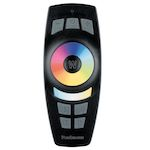

*To contribute to this page, edit the following
[file](https://github.com/Koenkk/zigbee2mqtt.io/blob/master/docs/devices/500.67.md)*

# Paulmann 500.67

| Model | 500.67  |
| Vendor  | Paulmann  |
| Description | RGB remote control |
| Supports | action |
| Picture |  |

## Notes


### Pairing
- Press W-key for 3 seconds
- Press Power On/Off Key for 5 seconds
- Press Power On/Off again for 3 seconds
Now the device should showup.

### Extended hue
The device gives extended hue values. Zigbee2MQTT calculates also the normal hue and provides both via mqtt.
- hue = extendedhue * 360 / 65536 % 360

### Device type specific configuration
*[How to use device type specific configuration](../information/configuration.md)*

* `simulated_brightness`: Set to `true` to simulate a `brightness` value (default: `false`).
If this device provides a `brightness_move_up` or `brightness_move_down` action it is possible to specify the update
interval and delta. This can be done by instead of specifying `true`:

```yaml
simulated_brightness:
  delta: 20 # delta per interval, default = 20
  interval: 200 # interval in milliseconds, default = 200
```


## Manual Home Assistant configuration
Although Home Assistant integration through [MQTT discovery](../integration/home_assistant) is preferred,
manual integration is possible with the following configuration:



```yaml
sensor:
  - platform: "mqtt"
    state_topic: "zigbee2mqtt/<FRIENDLY_NAME>"
    availability_topic: "zigbee2mqtt/bridge/state"
    icon: "mdi:gesture-double-tap"
    value_template: "{{ value_json.action }}"

sensor:
  - platform: "mqtt"
    state_topic: "zigbee2mqtt/<FRIENDLY_NAME>"
    availability_topic: "zigbee2mqtt/bridge/state"
    icon: "mdi:signal"
    unit_of_measurement: "lqi"
    value_template: "{{ value_json.linkquality }}"
```



