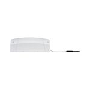

*To contribute to this page, edit the following
[file](https://github.com/Koenkk/zigbee2mqtt.io/blob/master/docs/devices/50044.md)*

# Paulmann 500.44

| Model | 500.44 |
| Vendor  | Paulmann  |
| Description | SmartHome Zigbee Dimmer 
| Supports | on/off, brightness |
| Picture |  |

## Notes

### Resetting
Resetting this device requires a switch or similiar to cut power from the device. Reset procedure is the following:

1. Device needs to be on for at least 5s
2. remove the power from the device for at least 3s
3. restore power to the device for at most 2s
4. repeat steps 2 and 3 four more times (5 times in total)
5. The device should now indicate with a breathing light for 10s that reset succeeded. Swithing off now cancels the reset.

### Pairing
After resetting the dimmeer will automatically connect.


### Device type specific configuration
*[How to use device type specific configuration](../information/configuration.md)*


* `transition`: Controls the transition time (in seconds) of brightness,
color temperature (if applicable) and color (if applicable) changes. Defaults to `0` (no transition).
Note that this value is overridden if a `transition` value is present in the MQTT command payload.


## Manual Home Assistant configuration
Although Home Assistant integration through [MQTT discovery](../integration/home_assistant) is preferred,
manual integration is possible with the following configuration:



```yaml
light:
  - platform: "mqtt"
    state_topic: "zigbee2mqtt/<FRIENDLY_NAME>"
    availability_topic: "zigbee2mqtt/bridge/state"
    brightness: true
    schema: "json"
    command_topic: "zigbee2mqtt/<FRIENDLY_NAME>/set"

sensor:
  - platform: "mqtt"
    state_topic: "zigbee2mqtt/<FRIENDLY_NAME>"
    availability_topic: "zigbee2mqtt/bridge/state"
    unit_of_measurement: "-"
    value_template: "{{ value_json.linkquality }}"
```



