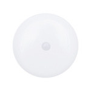

*To contribute to this page, edit the following
[file](https://github.com/Koenkk/zigbee2mqtt.io/blob/master/docs/devices/5AA-SS-ZA-H0.md)*

# Leedarson 5AA-SS-ZA-H0

| Model | 5AA-SS-ZA-H0  |
| Vendor  | Leedarson  |
| Description | Motion sensor |
| Supports | occupancy, illuminance |
| Picture |  |

## Notes

### Device type specific configuration
*[How to use device type specific configuration](../information/configuration.md)*

* `illuminance_lux_precision`: Controls the precision of `illuminance_lux` values, e.g. `0` or `1`; default `1`.
To control the precision based on the illuminance_lux value set it to e.g. `{1000: 0, 100: 1}`,
when illuminance_lux >= 1000 precision will be 0, when illuminance_lux >= 100 precision will be 1.


* `illuminance_lux_calibration`: Allows to manually calibrate illuminance values,
e.g. `95` would take 95% to the illuminance reported by the device; default `100`.


## Manual Home Assistant configuration
Although Home Assistant integration through [MQTT discovery](../integration/home_assistant) is preferred,
manual integration is possible with the following configuration:



```yaml
binary_sensor:
  - platform: "mqtt"
    state_topic: "zigbee2mqtt/<FRIENDLY_NAME>"
    availability_topic: "zigbee2mqtt/bridge/state"
    payload_on: true
    payload_off: false
    value_template: "{{ value_json.occupancy }}"
    device_class: "motion"

sensor:
  - platform: "mqtt"
    state_topic: "zigbee2mqtt/<FRIENDLY_NAME>"
    availability_topic: "zigbee2mqtt/bridge/state"
    unit_of_measurement: "-"
    device_class: "illuminance"
    value_template: "{{ value_json.illuminance }}"

sensor:
  - platform: "mqtt"
    state_topic: "zigbee2mqtt/<FRIENDLY_NAME>"
    availability_topic: "zigbee2mqtt/bridge/state"
    unit_of_measurement: "lx"
    device_class: "illuminance"
    value_template: "{{ value_json.illuminance_lux }}"

sensor:
  - platform: "mqtt"
    state_topic: "zigbee2mqtt/<FRIENDLY_NAME>"
    availability_topic: "zigbee2mqtt/bridge/state"
    icon: "mdi:signal"
    unit_of_measurement: "lqi"
    value_template: "{{ value_json.linkquality }}"
```



