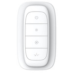

*To contribute to this page, edit the following
[file](https://github.com/Koenkk/zigbee2mqtt.io/blob/master/docs/devices/6ARCZABZH.md)*

# Leedarson 6ARCZABZH

| Model | 6ARCZABZH  |
| Vendor  | Leedarson  |
| Description | 4-Key Remote Controller |
| Supports | on/off, brightness up/down and click/hold/release, cct |
| Picture |  |

## Notes


### Deprecated click event
By default this device exposes a deprecated `click` event. It's recommended to use the `action` event instead.

To disable the `click` event, set `legacy: false` for this device in `configuration.yaml`. Example:

```yaml
devices:
  '0x12345678':
    friendly_name: my_device
    legacy: false
```

### Device type specific configuration
*[How to use device type specific configuration](../information/configuration.md)*

* `legacy`: Set to `true` to disable the legacy integration (highly recommended!)


* `transition`: Controls the transition time (in seconds) of on/off, brightness,
color temperature (if applicable) and color (if applicable) changes. Defaults to `0` (no transition).
Note that this value is overridden if a `transition` value is present in the MQTT command payload.


## Manual Home Assistant configuration
Although Home Assistant integration through [MQTT discovery](../integration/home_assistant) is preferred,
manual integration is possible with the following configuration:



```yaml
sensor:
  - platform: "mqtt"
    state_topic: "zigbee2mqtt/<FRIENDLY_NAME>"
    availability_topic: "zigbee2mqtt/bridge/state"
    unit_of_measurement: "%"
    device_class: "battery"
    value_template: "{{ value_json.battery }}"

sensor:
  - platform: "mqtt"
    state_topic: "zigbee2mqtt/<FRIENDLY_NAME>"
    availability_topic: "zigbee2mqtt/bridge/state"
    icon: "mdi:gesture-double-tap"
    value_template: "{{ value_json.action }}"

sensor:
  - platform: "mqtt"
    state_topic: "zigbee2mqtt/<FRIENDLY_NAME>"
    availability_topic: "zigbee2mqtt/bridge/state"
    icon: "mdi:signal"
    unit_of_measurement: "lqi"
    value_template: "{{ value_json.linkquality }}"
```



