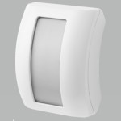

*To contribute to this page, edit the following
[file](https://github.com/Koenkk/zigbee2mqtt.io/blob/master/docs/devices/AV2010_14.md)*

# SMaBiT (Bitron Video) AV2010/14

| Model | AV2010/14  |
| Vendor  | SMaBiT (Bitron Video)  |
| Description | Curtain motion detector |
| Exposes | occupancy, battery_low, linkquality |
| Picture |  |

## Notes

### Pairing
Pair the SMaBiT AV2010/14 sensor to Zigbee2MQTT by holding it close to the coordinator and pressing the indicator light/button at the front for about 10 seconds. The indicator light/button will flash red once to indicate it is in pairing mode. The SMaBiT AV2010/22 sensor should now be visible in the Zigbee2MQTT Devices overview.

## Exposes

### Occupancy (binary)
Indicates whether the device detected occupancy.
Value can be found in the published state on the `occupancy` property.
It's not possible to read (`/get`) or write (`/set`) this value.
If value equals `true` occupancy is ON, if `false` OFF.

### Battery_low (binary)
Indicates if the battery of this device is almost empty.
Value can be found in the published state on the `battery_low` property.
It's not possible to read (`/get`) or write (`/set`) this value.
If value equals `true` battery_low is ON, if `false` OFF.

### Linkquality (numeric)
Link quality (signal strength).
Value can be found in the published state on the `linkquality` property.
It's not possible to read (`/get`) or write (`/set`) this value.
The minimal value is `0` and the maximum value is `255`.
The unit of this value is `lqi`.

